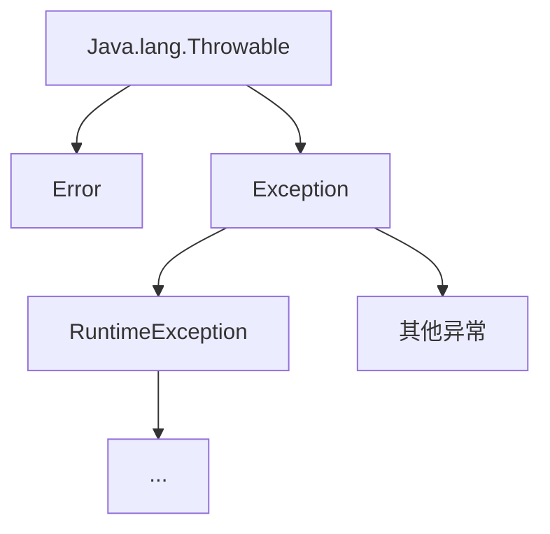

# **Java基础**


适用于已经学习过一遍的

## 基础语法

### 变量

变量用来记住程序要处理的数据，定义形式为 数据类型 变量名=具体数据

`int num =0;`

变量需要先声明，后使用

什么样的变量就存储什么类型的数据

变量定义时可以不赋值，但是要使用就必须赋值，即

```java
int num;

num=2;
```

### 关键字

Java中自己保留的一些词，具有特殊作用，如：public, static,abstract,int等等这些，我们不能将这些来作为类型，变量名

### 标识符

标识符就是名字，如类名，变量名等都是标识符

基本要求：由数字、下划线_、英文和美元符号$等组成

强制要求：不能以数字开头、不能使用关键字作为标识符、且大小写敏感，即大小写区分的

### 数据类型

数据类型分为两种：基本数据类型和引用数据类型

**基本数据类型**：四大类共八种

1. 整型：byte、short、int（默认）、long  ，默认值均为0
2. 浮点型：float、double（默认） ，默认值均为0.0
3. 字符型：char，默认值null
4. 布尔型：boolean ，默认值为false

**引用数据类型**：String、类、数组 ，默认值为null

### 类型转换

类型转换有自动类型转换以及强制类型转换

一般用于数据赋值时，如浮点变量想要获取整形数据，那么就会进行自动类型转换

**自动类型转换**：范围小的赋值给范围大的，就会进行自动类型转换

一般用于数据赋值时，如整形变量想要获取浮点数据，那么需要进行强制类型转换，但是这也会造成精度的损失

**强制类型转换**：将某一个类型转换为另一个类型，可能会造成精度损失

格式一般为：`int num =6.90;`

转换后不会进行四舍五入，只会将后面的小数位去掉

### 运算符

#### 基础运算符

+、-、*、/、% 一般就是这五个运算符

其中需要注意 除法（/）如果是两个整数做除法，那么他的结果一定是整数，此处就很好的体现了自动类型转换，因为这边的最大类型就是整数，所以结果就只能是整数

对于加法（+）如果是和字符串做+运算，那么就是连接字符串，得到的结果就是一串字符串

如果是和数字，即正常做加法，数据类型为最大数据类型（因为自动类型转换）

#### 自增、自减运算符

++、-- 这两种

这两个运算符只能用于变量

他们在使用时，既可以放在前面，也可以放在后面，根据位置的不同，所体现的意义也不相同

如果仅仅是单独使用，那么放在前面还是后面都没有什么区别

如果要对改变量进行使用，那么就存在区别，如下例子

```java
int num =1;
System.out.println(num++);
System.out.println(num);
```

如上例，输出的就会是1，2

那么放在前面呢

```java
int num =1;
System.out.println(++num);
System.out.println(num);
```

这样的话，输出的就是2,2

对于--也是同样的道理，因此

在前在后的区别在于：

在前面就先做运算，在做其他

在后面就先做其他，再做运算

#### 赋值运算符

基本赋值运算符（=）

将右边数据赋值给左边

扩展的赋值运算符：-=、+=、*=、/=、%=

```Java
a-=b;
a=a-b;
```

以上两个等同，即赋值运算符的意义

同时，扩展的赋值运算符自带强制类型转换，转a的类型

#### 关系运算符

逻辑运算符有：>、>=、==、<、<=、!=

在Java中，判断相等不能只用一个=，而是必须使用==，其他的则正常逻辑理解即可

#### 逻辑运算符

逻辑运算符有：&、&&、|、||、!、^

&、&&：逻辑与，条件之中有一个为假就返回false

|、||：逻辑或，条件中有一个为真久返回true

！：逻辑非，取反，真为假，假为真

^：逻辑异或，前后条件相同，返回false，条件不同则返回true

实际开发中使用&&和||，一般不使用&和|

#### 三元运算符

也称三元表达式、格式为： 条件表达式？值1：值2;

其意为：判断条件表达式，如果为true，则返回值1，否则返回值2

```Java
int num=2;     
int i = num > 1 ? num : -1;
System.out.println(i);
```

上述代码 输出2

#### 运算符优先级

| 优先级 | 运算符                                        | 结合性   |
| ------ | --------------------------------------------- | -------- |
| 1      | () [] .                                       | 从左到右 |
| 2      | ! +(正)  -(负) ~ ++ --                        | 从右向左 |
| 3      | * / %                                         | 从左向右 |
| 4      | +(加) -(减)                                   | 从左向右 |
| 5      | << >> >>>                                     | 从左向右 |
| 6      | < <= > >= instanceof                          | 从左向右 |
| 7      | ==  !=                                        | 从左向右 |
| 8      | &(按位与)                                     | 从左向右 |
| 9      | ^                                             | 从左向右 |
| 10     | \|                                            | 从左向右 |
| 11     | &&                                            | 从左向右 |
| 12     | \|\|                                          | 从左向右 |
| 13     | ?:                                            | 从右向左 |
| 14     | = += -= *= /= %= &= \|= ^=  ~=  <<= >>=  >>>= | 从右向左 |

## 流程控制

看这里之前可以先看Java自带API下的键盘输入类

### if流程控制

一般格式为：

```
if(判断条件)

{ 语句块}
//
if()
{

}else 
{

}


if()
{

}
else if()
{

}

```

也可以多层嵌套

### Switch流程控制

```java
switch(表达式){
    case 值1:
        代码;
        break;
    case 值2:
         代码;
        break;
        ···
    default:
        代码;
}
```

break用于跳出分支，不往下执行，不使用break的情况下 适用于不同值，做相同操作

default是值都不匹配的情况下，执行的操作

多层的if-else if 建议使用Switch进行代替

注意表达式类型只能是byte、short、int、char、枚举（JDK5）、String（JDK7）

对于double、float、long并不支持

### 循环控制

对于需要多次运行的代码，就需要使用到循环来进行操作，如输出1-100的数据

#### for循环

for循环写法一般为

```
for(int i=1;i<=100;i++)
{
	System.out.println(i);
}
```

其中int i=1，为定义的临时变量，i<100此处为控制循环的条件，只要满足就进行循环执行{}里面的代码，i++代表每次执行完一次{}之后就对i进行自增，用来控制循环的退出

#### while循环

while循环写法一般为

```java
/*while(条件){
    
}*/
int i=1
while(i<=100){
    System.out.println(i);
    i++;
}
```

和上面的for循环效果一样，只不过写法不同，二者可进行转换

while一般用来做死循环，达到某种条件，退出循环

#### do-while循环

do-while循环写法一般为

```
int i=1
do{
 System.out.println(i++);
}while(i<=100);
```

这种循环的好处是，必定会执行一次代码块，其后根据条件来进行判断是否继续执行，真循环，假结束

循环是可以进行嵌套的，但是套的太多了会影响性能

#### 跳转关键字

跳转关键字有 break；continue；

break：跳出并结束当前所在循环的执行，用于结束当前循环或者结束break分支

continue：用于跳出当前循环的当次执行，直接进入下一次执行，只能在循环之中使用

## Java数组

数组：用来存储多个**数据类型相同**的数据的一种数据结构，通过下标进行访问，下标从0开始，依次递增

数组的定义： 数据类型[] 数组名; 如`int[] numArray;`也可以使用 数据类型 数组名[] ，两种都可以，推荐第一种

数组的初始化：静态初始化数组和动态初始化数组

### 静态初始化

在创建时就对数组的元素值进行赋值，

格式为 数据类型[] 数组名= new 数据类型[]{数组内容}，如下：

```java
int[] numArray=new int[]{1,2,3,4,5};
int[] numArray={1,2,3,4,5}//和上面等同
```

访问数组：在数组中想要获取其中的某个数据，通过其下标来进行获取，数组名[下标]

如想要获取上面数组中的数字3，则通过`int num=numArray[2];`即可获取到，如果数组下标超出，会报错数组下标越界

数组长度通过数组名.length 进行获取，一般用来做数组的循环处理

数组索引长度最大为 数组名.length-1

### 动态初始化

定义数组时先不存入具体的元素值，只声明数组所存储的数据类型以及长度

格式为：数据类型[] 数组名=new 数据类型[长度];  如`int[] numArray=new int[5];`

此处注意一点：静态初始化和动态初始化不能混用，即不能使用`int[] numArray=new int[5]{1,2,3,4,5};`这是不被允许的

**二者使用场景：**

动态初始化：适合开始不确定具体元素值，只知道元素个数的场景

静态初始化：适合一开始就知道要存入什么元素的场景

后续学了ArrayList之后，大概率不会用到它了，了解即可

### 数组小测试

要求：通过输入员工数，以及他们的工资 ，然后求他们的总工资，最高工资，最低工资，平均工资。然后反转数组，反转之后再对其进行随机排名。

在这里，我因为个人编码习惯，使用了方法还有Array的toString方法来进行简化代码，你现在可以不知道，他仅仅是让你少些一点代码而已，按照上面的知识照样能实现，下面就马上讲方法

```java
public class Demo {
    public static void main(String[] args) {

        System.out.print("请输入有多少员工：");
        Scanner sc=new Scanner(System.in);
        int nums = sc.nextInt();
        int numArray[]=new int[nums];
        for (int i = 0; i < nums; i++) {
            System.out.print("请输入员工"+(i+1)+"的工资：");
            numArray[i]=sc.nextInt();
        }
        int max=numArray[0];
        int min=numArray[0];
        int sum=numArray[0];
        for (int i = 1; i < numArray.length; i++) {
            if(numArray[i]>max){
                max=numArray[i];
            }
            if(numArray[i]<min){
                min=numArray[i];
            }
            sum+=numArray[i];
        }
        System.out.println("最大值为："+max);
        System.out.println("最小值为："+min);
        System.out.println("总和为："+sum);
        System.out.println("反转前："+Arrays.toString(numArray));
        int[] ints = ResArray(numArray);
        System.out.println("反转后："+Arrays.toString(ints));
        System.out.println("随机排名后："+Arrays.toString(RandomOrder(ints)));
    }
    public static int[] ResArray(int[] arr)
    {
        int temp=0;
            for (int i = 0,j=arr.length-1; i < j; i++,j--) {
                temp=arr[i];
                arr[i]=arr[j];
                arr[j]=temp;
            }
        return  arr;
    }

    public static int[] RandomOrder(int[] arr){
        Random r=new Random();
        int index;
        int temp=0;
        for (int i = 0; i < arr.length; i++) {
            index = r.nextInt(arr.length);//生成[0,length)的数据，下标
            temp=arr[i];
            arr[i]=arr[index];
            arr[index]=temp;
        }
        return arr  ;
    }
}
```

### 数组在内存中的执行原理***

首先需要知道，我们所编写的Java代码会被编译成一个个的class文件，而class文件则是加载在JVM（Java虚拟机）的方法区中的，而后将其中的main方法放入栈中，变量也在栈中，基础变量在栈中，而凡是需要new的，则放在堆中，且在栈中存堆的对应数据的地址。

具体原理等推荐看这篇JAVA内存管理

[java内存管理（堆、栈、方法区）_java方法进栈内存分配-CSDN博客](https://blog.csdn.net/Liveor_Die/article/details/77895631)

## Java方法

方法是一种语法结构，是对一段代码将其封装成一个功能，通过名字就能够进行调用，便于代码复用

方法也是在栈中运行，同时这里说下栈是先进后出的

格式一般为：

```Java
/*
修饰符 (static看情况) 返回值类型 方法名(形参列表){
方法体代码(所需要执行的操作)
return 返回值;
}
当然 也可以设置为无返回类型
*/
 public static int[] RandomOrder(int[] arr){
        Random r=new Random();
        int index;
        int temp=0;
        for (int i = 0; i < arr.length; i++) {
            index = r.nextInt(arr.length);//生成[0,length)的数据，下标
            temp=arr[i];
            arr[i]=arr[index];
            arr[index]=temp;
        }
        return arr  ;
    }
```

形参可以有多个，使用逗号（,）进行分隔

方法调用 如用static修饰，那么直接类名.方法名()直接调用，否则需要new 改方法所在类 生成一个实例，然后再通过实例.方法名()进行调用

对于方法而言，其中形参列表以及对应返回值均可为空，如：

不需要返回值时，返回类型为void ，不写return语句。

不需要传入参数时，参数可为空直接写()

### Java方法的参数传递

在Java中，有两种参数传递方法：值传递和引用传递

#### 值传递

在调用函数时，将实际参数复制一份传递到函数中，这样在函数中对参数进行修改，就不会影响到原来的实际参数；

#### 引用传递

在调用函数时，将实际参数的地址直接传递到函数中。这样在函数中对参数进行的修改，就会影响到实际参数；

具体是值传递还是引用传递，主要看传入的参数的类型是否是引用类型，如果是，则是引用传递

#### 比较小案例

```Java
public class Demo {
    public static void main(String[] args) {
        int num=10;
        change(num);
        System.out.println("============");
        System.out.println(num);
        System.out.println("============");
        int[] numArray={1,2,34,5};
        changeArray(numArray);
        System.out.println("=============");
        System.out.println(Arrays.toString(numArray));
    }
    public static void change(int a ){
        System.out.println(a);
        a=20;
        System.out.println(a);
    }

    public static void changeArray(int[] num){
        System.out.println(Arrays.toString(num));
        num[0]=1099;
        System.out.println(Arrays.toString(num));
    }
}
```

运行后就会发现，引用传递如果在方法中改变了它的值，在方法结束后也会同步影响原来的值，而值传递则不会。原因是引用传递传参时传入的是地址。

### 方法重载

在一个类中，如果出现多个方法名称相同，但是它们的形参列表不同，那么这些方法就可以称为方法重载。

需要注意的是，其他的如（返回值类型，修饰符）这些相同或者不相同不影响是否是方法重载

而形参列表不同指的是，参数个数不同，参数类型不同，参数顺序不同（需两个或以上的参数，且这两个参数类型不相同），不包括参数名字

### Java方法测试

需求：求1-n的和,并判断其奇偶性

```java
public class Demo {
    public static void main(String[] args) {
        int sum=SumCount(10);
        System.out.println(sum );
        IsOddNumber(sum);
    }
    //1-n之和
    public static int SumCount(int n){
        int sum =0;
        for (int i = 1; i <= n; i++ ){
            sum+=i;
        }
        return sum;
    }
    //是否是奇数
    public static boolean IsOddNumber(int n){
        if(n%2==0)
        {
            System.out.println(n+"是偶数");
            return false;
        }else {
            System.out.println(n+"是奇数");
            return true;
        }
        //return n % 2 == 0 ? true : false;//三元表达式等同上面的代码,除了输出语句
    }
}
```

需求2：购买机票，按照淡季，旺季，头等，经济进行相应的优惠，优惠方案为：5-10月为旺季，头等舱9折，经济舱8折，11-4为淡季，头等舱7折，经济舱6折，计算用户买票所需要的金额，月份、舱位等级、票数由用户输入。

```java
public class Demo {
    public static void main(String[] args) {
        System.out.print("请输入当前月份：");
        Scanner sc=new Scanner(System.in);
        int month = sc.nextInt();
        System.out.print("请输入想要购买的舱位等级(1:头等舱，2：经济舱)：");
        int level = sc.nextInt();
        System.out.print("请输入想要购买的票数：");
        int count = sc.nextInt();

        System.out.println("你的购票总价为："+Price(month, level, count)+"共"+count+"张");
    }
    public static boolean IsWang(int month){
        if(month>=5&&month<=10)
        {
            System.out.println("当前为："+month+"月， 为旺季");
            return true;
        }else
        {
            System.out.println("当前为："+month+"月， 为淡季");
            return false;
        }
        // return (month>=5&&month<=10)?true:false; 三元表达式 和上面相等
    }
    public static int Price(int month,int level,int count){
        if(IsWang(month)&&level==1){
            return (int) (1000*0.9*count);
        } else if (IsWang(month)&&level==2) {
            return (int) (1000*0.8*count);
        } else if (!IsWang(month)&&level==1) {
            return (int) (1000*0.7*count);
        } else if (!IsWang(month)&&level==2) {
            return (int) (1000*0.6*count);
        }else {
            System.out.println("您的输入有误");
            return -1;
        }
    }
}
```

## Java自带Api

### 键盘输入Scanner类

通过Scanner类中的next()方法来进行键盘的数据读入，示例如下：

```java
Scanner sc=new Scanner(System.in);
String next = sc.next();
System.out.println(next);
```

运行之后，回让你输入信息，输入完信息后，点击回车，就会将刚刚输入的信息输出出来

这里因为next()方法 获取到的是字符串，所以使用的是字符串来进行接收，也可以使用nextInt()、nextDouble()等这些方法，他们接受的是指定类型的数据。

当然，一般建议直接接受字符串，后续按照需要做强转即可

### 随机数生成类Random

Java中可以使用Random生成随机数

一般使用为

```
Random r=new Random();
r.nextInt(10)//这就是生成[0,10)之间的数，且是整数，同理改为nextDouble即为生成小数
```

Random r=new Random();

如果 Random()中不使用参数，那么就默认将使用默认的种子来生成随机数，默认种子数一般为当前系统时间的毫秒数

想要生成指定范围内的随机数，如[50,100)

```
Random r=new Random();
r.nextInt(50)+50
r.nextInt(14)+3//[3-16] //因为是整数，所以可以这样取
r.nextDouble(14)+3//[3-17) //浮点数就不一样了

//int randNumber = rand.nextInt(MAX - MIN + 1) + MIN; //这就是随机数的生成公式
```


随机数测试：猜数案例

随机生成一个1-100的数，进行猜数，最多猜10次，每次猜玩进行提示，成功退出，达到10次退出，并公布正确答案

示例代码

```Java
import java.util.Random;
import java.util.Scanner;

public class RandomTest {
    public static void main(String[] args) {
        Random random=new Random();
        double v = random.nextInt(100)%(100-1+1) + 1;
        //double v2 = random.nextInt(100) + 1;
        boolean flag=true;
        Scanner sc=new Scanner(System.in);
        int count=1;
        while (flag)
        {
            System.out.print("请猜数字1-100 :");
            int i = sc.nextInt();
            System.out.println("你猜的数字是："+i);
            count++;
            if(i==v)
            {
                System.out.println("你猜对了,总共猜了"+count+"次");
                break;
            }else if(i>v)
            {
                System.out.println("你猜大了");
            }else
            {
                System.out.println("你猜小了");
            }
            if(count>=10)
            {
                System.out.println("猜了"+count+"次，未猜对，正确答案为："+v+"游戏结算！");
                break;
            }
        }

    }
}
```

## String

String对象是不可变字符串，通过""双引号来进行声明的，会放到堆内存中的字符串常量池中，且相同内容的字符串只会存储一份，

通过new生成的字符串，则直接进入堆内存中，及时相同内容，他们都会拥有不同的地址值。

连接是将两个字符组装起来，在堆里面生成一个新的字符串，然后再将这个地址返回给它

### String创建对象封装字符串数据的方式

方式一：Java中的所有字符串文字都为此类的对象，如随意的一个字符串"asdasd"

方式二：调用String类的构造器初始化字符串对象

构造器：

public String()  创建一个空白字符串对象，不含有任何内容

public String(String str)   根据传入的字符串内容，创建字符串对象

public String(char[] ch)   根据传入的字符数组的内容，创建字符串对象

public String(byte[] byte) 根据传入的字节数组的内容，创建字符串对象

### String的常用方法

public int length() 获取字符串长度

public char charAt(int index)  获取某个索引的字符返回，索引从0开始

public char[] toCharArray()  将当前字符串转换成字符数组并返回

public boolean equals(Object object)  判断当前字符和另一个字符内容是否相同

public boolean equalsIgnoreCase(String str) 忽略大小写进行判断

public String substring(int beginIndex,int endIndex)  按照索引进行截取，包前不包后

public String substring(int index)  按照索引进行截取，到末尾

public String replace(char old,char new)    使用新值替换旧值

public boolean contains(char s) 判断是否包含某个字符

public boolean startswith(string s)   判断是否以某个字符串开头

public String[] split(String r)   把字符串按照某个字符串进行分隔，并返回字符串数组

### String小测试

需求：开发登录页面，提示用户输入用户名和密码，对登录进行验证，最多输错三次，密码长度不能超过8位

```Java
public class Demo {
    public static void main(String[] args) {
            UserOperator u=new UserOperator();
            u.start();
    }
    public static class User{
        private String userName;
        private String passWord;

        public User() {
        }

        public User(String userName, String passWord) {
            this.userName = userName;
            this.passWord = passWord;
        }

        public String getUserName() {
            return userName;
        }

        public void setUserName(String userName) {
            this.userName = userName;
        }

        public String getPassWord() {
            return passWord;
        }

        public void setPassWord(String passWord) {
            this.passWord = passWord;
        }
    }

    public static class UserOperator{
        private User user;

        public UserOperator() {
        }

        public UserOperator(User user) {
            this.user = user;
        }

        public User getUser() {
            return user;
        }

        public void setUser(User user) {
            this.user = user;
        }

        public boolean CheckLogin(){
            if(user.getUserName().equals("admin")&&user.getPassWord().equals("admin")){
                return true;
            }
            return false;
        }

        public  void start(){
            int count=1;
            Scanner s=new Scanner(System.in);
            String userName;
            String passWord;
            User user=new User();

            while (true){
                System.out.print("请输入账户：");
                userName=s.next();
                System.out.print("请输入密码：");
                passWord=s.next();
                user.setUserName(userName);
                user.setPassWord(passWord);
                setUser(user);
                if(CheckLogin()){
                    System.out.println("登录成功");
                    break;
                }else{
                    System.out.println("账号或密码错误，请重新登陆，您当前登陆失败次数："+count+",达到三次自动退出系统");
                }
                if(count<3) {
                    count++;
                }else {
                    break;
                }
            }
        }
    }
}

```

## ArrayList

ArrayList<T> 作为做常用的一种集合，必须会使用

首先，我们先了解什么是集合：集合是一种容器，用来装数据的，类似与数组，集合相对于数组，大小可变，先了解ArrayList

构造器 ArrayList()  创建一个空的集合

### 常用方法：

public boolean add(E e) 将指定的元素添加到此集合的末尾

public void add(int index,E e)  将指定元素插入指定的位置，通过索引确定，索引从0开始

public E get(int index)  返回索引处的元素

public int size()  返回集合中元素的个数

public E remove(int  index) 移出指定位置的元素，返回被删除的元素

public boolean remove(Object o)  删除指定的元素，删除之后，后面的索引会自动减一

public E set(int  index ,E e)  修改索引处的元素，返回被修改的元素

附加： 想要删除包含某个字符的所有元素，配合String的contains方法使用，配合循环

### ArrayList小测试

需求：货物展示系统，同时需要制作货物的上架，下架

```Java
public class Demo {
    public static void main(String[] args) {
        goodsOperator g=new goodsOperator();
        g.start();
    }
    public static class Goods{
       private String  name;
       private BigDecimal price;
       private String info;

        public String getName() {
            return name;
        }

        public void setName(String name) {
            this.name = name;
        }

        public BigDecimal getPrice() {
            return price;
        }

        public void setPrice(BigDecimal price) {
            this.price = price;
        }

        public String getInfo() {
            return info;
        }

        public void setInfo(String info) {
            this.info = info;
        }
    }

    public static class goodsOperator{
        private List<Goods> goods=new ArrayList<Goods>();
        public void addGoods(){
            Goods g=new Goods();
            Scanner sc=new Scanner(System.in);
            System.out.print("请输入你想要添加的货物名：");
            String goodsName = sc.next();
            System.out.print("请输入你想要添加的货物价格：");
            BigDecimal price=sc.nextBigDecimal();
            System.out.print("请输入你想要添加的货物信息备注：");
            String info=sc.next();
            g.setName(goodsName);
            g.setPrice(price);
            g.setInfo(info);
            goods.add(g);
        }
        public void showGood(){
            if(goods.isEmpty()){
                System.out.println("当前还无货物！！！  请添加货物");
            }
            for (int i = 0; i < goods.size(); i++) {
                System.out.println("货物名："+goods.get(i).getName()+",价格："+goods.get(i).getPrice()+",备注信息："+goods.get(i).getInfo());
            }
        }
        public boolean removeGoods(){
            boolean flag=false;
            if(goods.isEmpty()){
                System.out.println("当前还无货物！！！  无法删除");
                return false;
            }
            Scanner sc=new Scanner(System.in);
            System.out.print("请输入要删除的货物名：");
            String name = sc.next();
            for (int i = 0; i < goods.size(); i++) {
                if(goods.get(i).getName().equals(name))
                {
                    goods.remove(i);
                    i--;
                    flag=true;

                }
                else{
                    System.out.println("货物名称有误！！删除"+name+"失败！！！");
                    flag=false;

                }
            }
            return flag;
        }

        public void start(){
            Scanner sc=new Scanner(System.in);
            while (true){
                System.out.println("==============欢迎来到货物管理系统==============");
                System.out.println("请选择你的操作：1、增加货物；2、删除货物，3、退出系统");
                showGood();
                int flag = sc.nextInt();
                switch (flag)
                {
                    case 1:
                        addGoods();
                        break;
                    case 2:
                        removeGoods();
                        break;
                    case 3:
                        System.out.println("退出系统！！！");
                        return;
                    default:
                        System.out.println("命令选择有误，请重新选择！！！！");
                        break;
                }
            }
        }
    }
}
```


# 面向对象基础

面向对象是相对面向过程而言的，这二者都是一直编程思想，面向过程强调的是功能、行为，暂时可以理解为一个个的方法函数，而面向对象是将功能封装进对象，强调的是具有了功能的对象

面向对象顾名思义就是把现实中的事务都抽象成为程序设计中的“对象”，其基本思想是一切皆对象，是一种“自下而上”的设计语言，先设计组件，再完成拼装。

**对象**：对象是类的一个实例（**对象不是女朋友**），有状态和行为。例如，一条狗是一个对象，它的状态有：颜色、名字、品种；行为有：摇尾巴、叫、吃等。 

**类**：类是一个模板，它描述一类对象的行为和状态。

面向对象的过程就是找对象、建立对象、使用对象、维护对象的关系的过程

类定义的一般格式：

```Java
/*
修饰符 class 类名{
1、成员变量，用来描述对象可以处理什么样数据 一般定义形式：修饰符 数据类型 变量名;
2、成员方法，用来描述对象拥有什么样的功能，对数据进行处理等 一般就是各种方法函数
}
*/
   public class Person{
        public String name;
        public int age;
        public void show(){
            System.out.println(name+": "+age);
        }
    }
```

**对象**

对象（Object）是系统中用来描述客观事物的一个实体，它是构成系统的一个基本单位。

创建对象：

```java
/*
类名 对象名=new 类名();
*/
Person p1=new Person();
```

使用对象：

```Java
/*
调用成员变量：对象名.成员变量
*/
p1.name="test";
/*
调用成员方法：对象名.成员方法
*/
p1.show();
```

**全局变量（成员变量）**

- 定义在方法的外部，类的内部。使用范围是整个类
- 不需要初始值
- 存储在**堆内存**中（对象存在时才在存在）

**局部变量（方法中的变量）**

- 定义在方法的内部或者某一个语句块的内部，适用范围仅限于方法内或者语句块内
- 必须有初始值
- 存储在**栈内存**中

成员变量可以直接在成员方法中使用，但是main方法中如果调用成员变量和方法必须通过对象.属性名\方法名(参数列表)的形式来调用

成员方法之间的调用，直接写方法名(参数列表)即可

**构造方法**
对象一建立就会调用构造方法，可以创建对象，给成员变量（属性）初始化。

方法名和类名相同
没有返回值和void，没有return
不能被static等关键字修饰
可以方法重载（定义多个参数列表不同的构造方法）
当一个类中没有写构造方法时，系统会默认给该类一个默认的无参构造方法。当自己定义构造方法后默认的构造方法就不存在了。（自己定义有参的构造方法后，如果还想使用无参的构造方法，就要自己再添加一个无参的构造方法）

**this关键字**

this代表它所在方法所属对象的引用。哪个对象调用的this所在的方法，this就代表哪个对象。

- 在没有static关键字修饰的方法中使用
- this关键的字用来区分成员变量和局部变量同名的情况：
- this关键字在构造方法中的第一行以 **this(参数列表)** 的形式出现时，就表示当前构造方法调用了该类中其他的构造方法（于参数列表相匹配的构造方法）：

```Java
 public  class Person{
        public String name;
        public int age;
        public void show(){
            System.out.println(name+": "+age);
        }

        public Person() {
            this("test",23);
        }

        public Person(String name, int age) {
            this.name = name;
            this.age = age;
        }
    }
```


### 面向对象的特性

#### 封装

两层含义：一层含义是把对象的属性和行为看成一个密不可分的整体，将这两者“封装”在一个不可分割的独立单元(即对象)中；

另一层含义指“信息隐藏”，把不需要让外界知道的信息隐藏起来，有些对象的属性及行为允许外界用户知道或使用，但不允许更改，而另一些属性或行为，则不允许外界知晓，或只允许使用对象的功能，而尽可能隐藏对象的功能实现细节。

封装有两种，属性的封装和方法的封装

**封装的优点**

良好的封装能够减少耦合，符合程序设计追求“高内聚，低耦合”。

类内部的结构可以自由修改。

可以对成员变量进行更精确的控制。

隐藏信息实现细节。

如上面的person类，封装之后应该为

```Java
public class Person{
        private String name;
        private int age;
        public void show(){
            System.out.println(name+": "+age);
        }

        public String getName() {
            return name;
        }

        public void setName(String name) {
            this.name = name;
        }

        public int getAge() {
            return age;
        }

        public void setAge(int age) {
            this.age = age;
        }

        public Person() {
            this("test",23);
        }

        public Person(String name, int age) {
            this.name = name;
            this.age = age;
        }
    }
```

#### 继承

程序中的继承性是指子类拥有父类的全部特征和行为，这是类之间的一种关系。

**继承的特点**

- 子类继承了父类的所有属性和方法，但是不包括私有属性（private）和构造方法
- 子类继承父类的属性和方法同时也可以有自己的属性和方法
- Java 只支持单继承。 也就是说一个子类只能有一个父类，父类可以有多个子类，但是可以通过接口来实现多继承！

- 继承让类与类之间产生了关系，类的耦合性增强了，父类发生变化子类也会跟着改变

继承使用extends关键字，只能单继承

```Java
 public static class Student extends Person {
        public void show(){          
            super.show();
            System.out.println("我是学生,"+getName()+": "+getAge());
        }
    }
```

super关键字，表示当前类的父类的引用

super两种用法：

- super.属性名、super.方法名(参数列表)
  - 表示父类的属性和方法，和子类中的属性或方法重名时使用
- super(参数列表)
  - 出现在子类构造方法的第一句代码时
  - 就是通过参数列表匹配父类的构造方法来创建父类对象


#### 多态

多态就是同一函数在不同类中有不同的实现；

- 面向对象的多态性，即“一个接口，多个方法”。
- 多态性体现在父类中定义的属性和方法被子类继承后，可以具有不同的属性或表现方式。
- 多态性允许一个接口被多个同类使用，弥补了单继承的不足。
- 利用父类类型实例化，**子类覆写父类的方法后**，运行时，动态的再指向子类的实现，即为多态

如下示例：

```Java

public class Demo {
    public static void main(String[] args) {
        Person person=new Person();
        person.show();
        Person s=new Student();//多态的形式
        s.show();
        Person t=new Teacher();//多态的形式
        t.show();
    }

    public static class Person{
        private String name;
        private int age;
        public void show(){
            System.out.println(getName()+": "+getAge());
        }

        public String getName() {
            return name;
        }

        public void setName(String name) {
            this.name = name;
        }

        public int getAge() {
            return age;
        }

        public void setAge(int age) {
            this.age = age;
        }

        public Person() {
            this("test",23);
        }

        public Person(String name, int age) {
            this.name = name;
            this.age = age;
        }
    }

    public static class Student extends Person {
        public void show(){
            System.out.println("=============");
            System.out.println("我是学生,"+getName()+": "+getAge());
        }
    }

    public static class Teacher extends Person {
        public void show(){
            System.out.println("=============");
            System.out.println("我是老师,"+getName()+": "+getAge());
        }
    }
}

```

### 实体类Java Bean

一种思想，将实体和操作进行分开，实体中不进行任何操作，只在操作类中进行操作，如：

```Java

public class Demo {
    public static void main(String[] args) {
        Person person=new Person("test",23);
        PersonOperator p=new PersonOperator(person);
        p.showMsg(); 
    }

    public static class Person{
        private String name;
        private int age;


        public String getName() {
            return name;
        }

        public void setName(String name) {
            this.name = name;
        }

        public int getAge() {
            return age;
        }

        public void setAge(int age) {
            this.age = age;
        }

        public Person() {

        }

        public Person(String name, int age) {
            this.name = name;
            this.age = age;
        }
    }

    public static class PersonOperator{
        private Person p;

        public PersonOperator() {
        }

        public PersonOperator(Person p) {
            this.p = p;
        }

        public Person getP() {
            return p;
        }

        public void setP(Person p) {
            this.p = p;
        }
        public  void showMsg(){
            System.out.println(p.getName()+":"+p.age);
        }
    }
}
```

实体类要求：

成员变量必须是私有的，且需要get,set方法；必须拥有无参构造函数。

实际开发中使用，目的是为了使得数据和数据的业务逻辑处理分离开来


# 小测验：ATM取款机系统

根据已学知识，已经可以制作一个ATM系统了

需求：功能为：登陆，开户、退出系统，开户之后回到功能选择，登陆后功能 查询账户、存款、取款、转账、修改密码、退出、注销账户，对每次的输入都进行校验

账户实体类 Account

```Java

public class Account {
    private String cardId;
    private String userName;
    private String passWord;
    private char Sex;
    private double money;
    private double xianE;

    public Account() {
    }

    public Account(String cardId, String userName, String passWord, char sex, double money, double xianE) {
        this.cardId = cardId;
        this.userName = userName;
        this.passWord = passWord;
        Sex = sex;
        this.money = money;
        this.xianE = xianE;
    }

    public String getCardId() {
        return cardId;
    }

    public void setCardId(String cardId) {
        this.cardId = cardId;
    }

    public String getUserName() {
        return userName;
    }

    public void setUserName(String userName) {
        this.userName = userName;
    }

    public String getPassWord() {
        return passWord;
    }

    public void setPassWord(String passWord) {
        this.passWord = passWord;
    }

    public char getSex() {
        return Sex;
    }

    public void setSex(char sex) {
        Sex = sex;
    }

    public double getMoney() {
        return money;
    }

    public void setMoney(double money) {
        this.money = money;
    }

    public double getXianE() {
        return xianE;
    }

    public void setXianE(double xianE) {
        this.xianE = xianE;
    }
}

```

账户操作类 ATM

```java

public class ATM {
    public static final Account a =new Account("11","test","111111",'男',100000,8000);
    ArrayList<Account> list=new ArrayList<>();

    Scanner sc=new Scanner(System.in);
    /*
    1、用户登陆
    2、用户开户
    3、退出
        1、查询账户
        2、存款
        3、取款
        4、转账
        5、修改密码
        6、退出
        7、注销账户
     */
    //启动方法
    public void start()
    {
        list.add(a);
        while (true)
        {
            System.out.println("======欢迎进入银行系统！！=======");
            System.out.println("请选择你想要的功能");
            System.out.println("1、用户登陆");
            System.out.println("2、用户开户");
            System.out.println("3、退出系统");
            switch (sc.next())
            {
                case "1":
                    if(this.list.isEmpty())
                    {
                        System.out.println("当前系统并无账户，不可登陆！请先开户");
                        break;
                    }
                    System.out.print("请输入用户名：");
                    String userName= sc.next();
                    System.out.print("请输入密码：");
                    String passWord= sc.next();
                    Account login = Login(userName, passWord);
                    if(login!=null)
                    {
                        System.out.println(userName+"登陆成功");
                        //查询等操作开始页面
                        boolean work = work(login);
                        if (!work)
                        {
                            return;
                        }
                    }

                    break;
                case "2":
                     CreateAccount();
                    break;
                case "3":
                    System.out.println("成功退出系统，下次再见！！!");
                    return;
                default:
                    System.out.println("输入命令有误！！！请重新输入！");
            }
        }
    }
    public Account Login(String userName,String passWord)
    {

        Account refAccount=null;
        for (Account account : this.list) {
            if(userName.equals(account.getUserName())&&passWord.equals(account.getPassWord()))
            {
                refAccount= account;
            }

        }
        return refAccount;
    }
    public void CreateAccount()
    {
        System.out.println("============欢迎进入开户页面===========");
        System.out.print("请输入卡号：");
        String cardId = sc.next();
        System.out.print("请输入用户名：");
        String userName = sc.next();
        System.out.print("请输入密码：");
        String passWord = sc.next();
        System.out.print("请输入性别：");

        char sex= 0;
        checkSex(sc,sex);
        System.out.print("请输入余额：");
        Double money=sc.nextDouble();
        System.out.print("请输入限额：");
        Double xianE=sc.nextDouble();
        Account account=new Account(cardId,userName,passWord,sex,money,xianE);
        boolean add = this.list.add(account);
        if(add)
        {
            System.out.println("用户开户成功！");
        }
        else
        {
            System.out.println("用户开户失败！");
            return;
        }

    }

    public void checkSex(Scanner sc,char sex)
    {
        while (true) {
            sex = sc.next().charAt(0);
            if(sex!='男' & sex!='女')
            {
                System.out.print("性别输入错误，请重新输入（男或女）：");
            }
            else {
                break;
            }
        }
    }
    public boolean work(Account login)
    {
        while (true){


          /*  1、查询账户
            2、存款
            3、取款
            4、转账
            5、修改密码
            6、退出
            7、注销账户*/
            System.out.println("=========="+login.getUserName() +"~欢迎进入银行系统！！=======");
            System.out.println("请选择你想要的功能");
            System.out.println("1、查询账户");
            System.out.println("2、存款");
            System.out.println("3、取款");
            System.out.println("4、转账");
            System.out.println("5、修改密码");
            System.out.println("6、退出");
            System.out.println("7、注销账户");
            switch (sc.next())
            {
                case "1":
                    System.out.println(login.getUserName()+"的余额为："+login.getMoney());
                    break;
                case "2":
                    CunKuan(login);
                    break;
                case "3":
                    System.out.print("请输入你想要取出的金额：");
                    double moneys= sc.nextDouble();
                   /* if(moneys>login.getXianE())
                    {
                        System.out.println("您的取款金额大于取款限额~");
                    }else {
                        if (moneys > login.getMoney()) {
                            System.out.println("您的余额不足~~");
                        }
                        login.setMoney(login.getMoney() - moneys);
                        System.out.println("您取款后余额为："+login.getMoney());
                    }*/
                    checkMoney(login,moneys);
                    break;
                case "4":
                    if(this.list.size()<2)
                    {
                        System.out.println("系统没有足够的用户进行转账操作~");
                    }
                    System.out.print("请输入对方账户卡号：");
                    String CardId= sc.next();
                    System.out.print("请输入转账金额：");
                    double m=sc.nextDouble();
                    for (Account account : this.list) {
                        if (CardId.equals(account.getCardId()))
                        {
                            checkMoney(login,m);
                            account.setMoney(account.getMoney()+m);
                            System.out.println("账户"+account.getUserName()+"的余额为："+account.getMoney());
                        }
                    }
                    //转账
                    break;
                case "5":
                    //修改密码
                    System.out.print("请输入原密码：");
                    String pass = sc.next();
                    if(pass.equals(login.getPassWord()))
                    {
                        System.out.print("请输入新密码：");
                        String newPassWord = sc.next();
                        System.out.print("请再次输入新密码：");
                        String RePassWord = sc.next();
                        if(newPassWord.equals(RePassWord))
                        {
                            login.setPassWord(newPassWord);
                            System.out.println("修改密码成功，请重新登陆");
                            return true;
                        }
                        else
                        {
                            System.out.println("两次密码不一致！！");
                        }
                    }
                    break;
                case "6":
                    //退出
                    System.out.println("成功退出系统，下次再见！！!");
                    return false;
                case "7":
                    //注销账户
                    System.out.print("您正在注销账户！！请确认是否真的注销！请输入（是：Y，否：N）：");
                    String s= sc.next();
                    if (s.equals("Y"))
                    {
                        if(list.remove(login))
                        {
                            System.out.println("您的账号注销成功！！！");
                            return false;
                        }else {
                            System.out.println("出现错误~请联系管理员");
                            return false;
                        }
                    } else if (s.equals("N")) {
                        System.out.println("取消注销~为您返回上一页面~");
                    }
                    break;
                default:
                    System.out.println("您输入的命令有误~ 请重新输入！");
                    break;
            }
        }
    }
    public void CunKuan(Account login)
    {
        while (true) {
            System.out.print("请输入你想要存入的金额：");
            double money = sc.nextDouble();
            if (money > 0) {
                login.setMoney(login.getMoney() + money);
                System.out.println("存入了" + money + "元，现在的余额为：" + login.getMoney());
                break;
            } else {
                System.out.println("您输入的金额不正确~请重新输入！！");
            }
        }
    }
    public void checkMoney(Account account,double moneys)
    {
        if(moneys>account.getXianE())
        {
            System.out.println("您的支出金额大于限额~");
        }else {
            if (moneys > account.getMoney()) {
                System.out.println("您的余额不足~~");
            }
            account.setMoney(account.getMoney() - moneys);
            System.out.println("您消费后余额为："+account.getMoney());
        }
    }
}

```

main方法调用

```java

public class ATMDemo {
    public static void main(String[] args) {
        ATM a=new ATM();
        a.start();
    }
}

```

至此，基础全部完结！！

# 扩展加强

## static修饰符

static  叫做静态，可以修饰成员变量，成员方法

### 修饰成员变量

成员变量按照有无static修饰，分为两种：

类变量：有static修饰，属于类，在计算机中只有一份，会被类的全部对象共享。其他对象如果做更改，那么它的值也会对应变化。可以直接使用类名.变量名来访问

实例变量（对象的变量）：无static修饰，即普通成员变量，属于每一个方法。

``` java
class Person{
    public static String name;//类变量
    private int age;//实例变量

    public Person() {
    }

    public Person(String name, int age) {
        this.name=name;
        this.age = age;
    }

    public static String getName() {
        return name;
    }

    public static void setName(String name) {
        Person.name = name;
    }

    public int getAge() {
        return age;
    }

    public void setAge(int age) {
        this.age = age;
    }
}
public class Demo {
    public static void main(String[] args) {

        Person p1=new Person("测试",12);
        System.out.println("通过静态调用，静态变量名为："+Person.name);
        Person.name="芜湖";
        System.out.println("通过实例调用，静态变量名为："+p1.getName()+"  实例变量："+p1.getAge());
        Person p2=new Person("起飞",23);
        System.out.println("通过实例调用，静态变量名为："+p2.getName()+"  实例变量："+p2.getAge());
    }


}


```

类变量一般用于 在程序中只需要一份的数据。如：计数器

### 修饰成员方法

同样按照有无static修饰，分为两种

类方法：有static修饰，属于类，可以直接使用类名.方法名进行调用，类方法中不能使用this关键字

实例方法：无static修饰，属于对象

```java

public class Demo {
    public static void main(String[] args) {

        Person p1=new Person("测试",12);
        System.out.println("通过静态调用，静态变量名为："+Person.name);
        Person.name="芜湖";
        System.out.println("通过实例调用，静态变量名为："+p1.getName()+"  实例变量："+p1.getAge());
        Person p2=new Person("起飞",23);
        System.out.println("通过实例调用，静态变量名为："+p2.getName()+"  实例变量："+p2.getAge());
        System.out.println("============================");
        Person.showStatic();
        p1.showMethod();
    }


}
class Person{
    public static String name;
    private int age;

    public Person() {
    }

    public Person(String name, int age) {
        this.name=name;
        this.age = age;
    }

    public static String getName() {
        return name;
    }

    public static void setName(String name) {
        Person.name = name;
    }

    public int getAge() {
        return age;
    }

    public void setAge(int age) {
        this.age = age;
    }

    public static void showStatic(){
        System.out.println("类方法被调用！！！");
    }

    public  void showMethod(){
        System.out.println("实例方法被调用！！！");
    }
}

```

一般用于制作工具类

### 代码块

代码块是类的五大成分之一（成员变量、构造器、成员方法、代码块、内部类）

代码块分为两种：静态代码块和实例代码块

**实际开发基本不用**

#### 静态代码块

格式为： 

```java
static{}
```

特点：在类加载是自动执行，由于类只会加载一起，所以静态代码块的内容也只会执行一次

作用：完成类的初始化，如：对类变量的初始化赋值

#### 实例代码块

格式为：

```java	
{}
```

特点：每次创建对象时，执行实例代码块，并且在构造器之前执行

作用：和构造器一样，都是用来完成对象的初始化，如：对实例变量进行初始化赋值

例子：

```java

public class Demo {
    public static void main(String[] args) {

       Person p1=new Person();
       Person p2=new Person();
    }


}
class Person{
    public static String name;
    private int age;

    static {
        System.out.println("静态代码块执行");
    }
    {
        System.out.println("实例代码块执行");
    }

    public Person() {
        System.out.println("无参构造调用");
    }

    public Person(String name, int age) {
        this.name=name;
        this.age = age;
    }

    public static String getName() {
        return name;
    }

    public static void setName(String name) {
        Person.name = name;
    }

    public int getAge() {
        return age;
    }

    public void setAge(int age) {
        this.age = age;
    }

    public static void showStatic(){
        System.out.println("类方法被调用！！！");
    }

    public  void showMethod(){
        System.out.println("实例方法被调用！！！");
    }
}

```

可以由此看出：静态代码块只会执行一次，实例代码块每次创建对象都会执行，且代码块都在构造函数之前执行

### 单例设计模式

对于static应用场景，最为广泛的就是单例设计模式。这是一种编程思想：即某一个类，仅仅只需要创建一次他的对象，不需要反复的创建，确保一个类只有一个对象，例子就是游戏中，主角角色只有一个，不能够通过new创建对象

单例有两种，饿汉式单例和懒汉式单例

写法为：

类的构造器私有，定义一个类变量记住该类的一个对象，定义一个方法，用来返回这个对象

```java
class Person{
    private static Person person;
    private static String name;
    private int age;

    public static Person getInstance(){
        if(person==null){
            person=new Person();
        }
        return person;
    }
    private Person(){
        System.out.println("无参构造调用");
    }
    private Person(String name, int age) {
        this.name=name;
        this.age = age;
    }

    public static String getName() {
        return name;
    }

    public static void setName(String name) {
        Person.name = name;
    }

    public int getAge() {
        return age;
    }

    public void setAge(int age) {
        this.age = age;
    }


}

public class Demo {
    public static void main(String[] args) {
        Person p1= Person.getInstance();
        Person p2= Person.getInstance();
        System.out.println(p1);
        System.out.println(p2);
        p1.setName("测试");
        System.out.println(p1.getName());
        System.out.println(p2.getName());
    }


}

```

这就是一种懒汉式单例，需要拿对象的时候再去创建对象，使用static final修饰

```java
class Person{
    private static final Person person=new Person();
    private static String name;
    private int age;

    public static Person getInstance(){
        return person;
    }
    private Person(){
        System.out.println("无参构造调用");
    }
    private Person(String name, int age) {
        this.name=name;
        this.age = age;
    }

    public static String getName() {
        return name;
    }

    public static void setName(String name) {
        Person.name = name;
    }

    public int getAge() {
        return age;
    }

    public void setAge(int age) {
        this.age = age;
    }
}
public class Demo {
    public static void main(String[] args) {

        Person p1= Person.getInstance();
        Person p2= Person.getInstance();
        System.out.println(p1);
        System.out.println(p2);
        p1.setName("测试");
        System.out.println(p1.getName());
        System.out.println(p2.getName());
    }


}
```

后续还会有线程安全的问题需要解决，这里暂时不讲

## final修饰符

final关键字就是最终的意思，可以用来修饰类、方法、变量

修饰类：被fianl修饰的类叫做最终类，它不可以被其他类继承

修饰方法：被fianl修饰的方法叫做最终方法，特点是他不可以被重写

修饰变量：被fianl修饰的变量叫做最终变量，它只能被赋值一次

fianl修饰变量的注意：

修饰基本类型的变量，变量存储的数据不能被改变。

修饰引用类型的变量，变量存储的地址不能被改变，但地址所指向的对象的内容是可变的。

```java

public class finalDemo {
    static final String msg="不可改变的变量";
    public static void main(String[] args) {
        final Person p1=new Person("Test",19);
        System.out.println(msg);
        System.out.println(p1);
        p1.setUserName("改变了");
        System.out.println(p1);
    }
}
class Person{
    String userName;
    int age;

    public Person() {
    }

    public Person(String userName, int age) {
        this.userName = userName;
        this.age = age;
    }

    public String getUserName() {
        return userName;
    }

    @Override
    public String toString() {
        return "Person{" +
                "userName='" + userName + '\'' +
                ", age=" + age +
                '}';
    }

    public void setUserName(String userName) {
        this.userName = userName;
    }

    public int getAge() {
        return age;
    }

    public void setAge(int age) {
        this.age = age;
    }
}

```


## 继承

集成是面向对象三大特性之一，使用extends关键字来实现继承，在Java中只能单继承，Java中，所有的类都直接或间接的继承Object类

继承的特点：子类能继承父类所有的非私有的成员和方法

集成后对象的创建：子类的对象是由子类、父类共同完成的

写法：

```java
public class B extends A{
    
}
```

其中A就称为B的父类（超类，基类），B就是A的子类（派生类）

继承可以对父类的方法进行重写，即父类的方法满足不了需求，可以对该方法进行重写

在子类中访问其他成员（成员方法，成员变量），依照就近原则，父类使用super，本类中使用this，方法中直接使用名称

```java

public class Demo {
    public static void main(String[] args) {
        B b=new B();
        b.show();

    }
}
class A {
    public String msg="父类名称";
    public A(){
        System.out.println("A的无参构造调用");
    }
    public A(String msg){
        this.msg=msg;
        System.out.println("A的有参构造调用");
    }
    public void show(){

        System.out.println("A:"+msg);
    }
}
class B extends A{
    String msg="子类名称";
    public B(){
        System.out.println("B无参构造调用");
    }
    public B(String msg){
        this.msg=msg;
        System.out.println("B的有参构造调用");
    }
    @Override
    public void show(){
        super.show();
        String msg="内部字段";
        System.out.println("B:"+msg);
        System.out.println("B:"+this.msg);
        System.out.println("B:"+super.msg);
    }
}

```

## 多态

多态是在继承/实现情况下的一种现象，表现为：对象多态，行为多态。

多态的前提：有实现/继承关系，存在方法重写

对象多态：即使用父类定义 子类实现，接口定义，实现类实现

行为多态：

```java

public class Demo {
    public static void main(String[] args) {
       A a=new B();//对象多态
       a.show();//行为多态
       System.out.println(a.msg);//成员变量不多态，输出A的msg
    }
}
class A {
    public String msg="父类名称";
    public A(){
        System.out.println("A的无参构造调用");
    }
    public A(String msg){
        this.msg=msg;
        System.out.println("A的有参构造调用");
    }
    public void show(){
        System.out.println("A:"+msg);
    }
}
class B extends A{
    String msg="子类名称";
    public B(){
        System.out.println("B无参构造调用");
    }
    public B(String msg){
        this.msg=msg;
        System.out.println("B的有参构造调用");
    }
    @Override
    public void show(){
        super.show();
        String msg="内部字段";
        System.out.println("B:"+msg);
        System.out.println("B:"+this.msg);
        System.out.println("B:"+super.msg);
    }
}

```

对于成员方法多态，编译看左，运行看有

对于成员变量，不存在多态，编译看左，运行看左

**多态的好处**

在多态形式下，右边是解耦合的，利于维护和扩展

定义方法时，使用父类型的形参，可以接收一切子类对象，扩展性更强，更加便利

**存在的问题**

多态不能够直接调用子类的独有方法，想要使用需要进行类型转换，转换前使用instanceof 进行判断类型，避免类型转换异常

```java

public class Demo {
    public static void main(String[] args) {
       A a=new B();
       go(a);
       System.out.println(a.msg);
        System.out.println("==================");
        A b=new B();
        go(b);
        System.out.println("==================");
        A c=new C();
        go(c);

    }
    public static void go(A a){
        a.show();
        if(a instanceof B){
            B b=(B) a;
            b.BMethod();
        } else if (a instanceof C) {
            C c=(C) a;
            c.CMethod();
        }
    }
}

class A {
    public String msg="父类名称";
    public A(){
        System.out.println("A的无参构造调用");
    }
    public A(String msg){
        this.msg=msg;
        System.out.println("A的有参构造调用");
    }
    public void show(){
        System.out.println("A:"+msg);
    }
}
class B extends A{
    String msg="子类名称";
    public B(){
        System.out.println("B无参构造调用");
    }
    public B(String msg){
        this.msg=msg;
        System.out.println("B的有参构造调用");
    }
    @Override
    public void show(){
        super.show();
        String msg="B内部字段";
        System.out.println("B:"+msg);
        System.out.println("B:"+this.msg);
        System.out.println("B:"+super.msg);
    }
    public void BMethod(){
        System.out.println("B独有方法！！");
    }
}


class C extends A{
    String msg="子类名称";
    public C(){
        System.out.println("B无参构造调用");
    }
    public C(String msg){
        this.msg=msg;
        System.out.println("B的有参构造调用");
    }
    @Override
    public void show(){
        super.show();
        String msg="C内部字段";
        System.out.println("C:"+msg);
        System.out.println("C:"+this.msg);
        System.out.println("C:"+super.msg);
    }
    public void CMethod(){
        System.out.println("C独有方法！！");
    }
}

```

## 抽象类

java中有一个关键字 abstract，它的意思就是抽象，可以用来修饰类和成员方法

用abstract修饰类时，这个类就是抽象类，修饰方法 ，这个方法就是抽象方法

### 特点

抽象类中不一定有抽象方法，但是有抽象方法的类一定是抽象类

类该有的成员，抽象类都可以有

抽象类不能创建对象，仅仅是作为父类，让子类继承并实现其抽象方法。

一个类继承一个抽象类，必须要实现所有的抽象方法，否则这个类也必须定义成抽象类

### 应用场景和好处

父类知道每个子类都要做某个行为，但是子类的情况都不一样，父类就定义成抽象方法，交给子类去重写实现，设计这样的抽象类，目的是为了更好的支持多态。

```java

public class AbstractDemo {
    public static void main(String[] args) {
        animals dog=new Dog();
        dog.setName("神犬");
        animals cat=new Cat();
        cat.setName("汤姆");
        dog.action();
        cat.action();
    }
}

abstract class animals{
    String name;


    public String getName() {
        return name;
    }

    public void setName(String name) {
        this.name = name;
    }

    public abstract void action();
}

class Dog extends animals {


    @Override
    public void action() {
        System.out.println("狗"+name+"的动作！");
    }


}
class Cat extends animals {

    @Override
    public void action() {
        System.out.println("猫"+name+"的动作！");
    }
}

```

主要应用场景：模板方法设计模式

为了解决代码重复问题，例：大部分代码相同，仅仅是中间部分代码不同，就可以使用这个设计模式来进行优化

写法：定义一个抽象类，里面定义两个方法，一个抽象方法：让子类实现不同的方法。 一个模板方法，放相同的代码和抽象方法。

且模板方法一般使用final修饰，防止子类重写

```java

public class TempAbstractDemo {
    public static void main(String[] args) {
        animalAction cat=new CatAction();
        cat.setName("汤姆猫");
        animalAction dog=new DogAction();
        dog.setName("嗨皮狗");
        cat.action();
        dog.action();
    }
}

abstract class animalAction {
    String name;


    public String getName() {
        return name;
    }

    public void setName(String name) {
        this.name = name;
    }

    final void action(){
        System.out.println("我是"+name);
        System.out.println("哥们饿了，要吃饭");
        System.out.println(eat());
        System.out.println("完蛋了，吃多了");
    }
    abstract String eat();
}
class CatAction extends animalAction{

    @Override
    String eat() {
        return "吃猫粮，猛猛吃";
    }
}
class DogAction extends animalAction{

    @Override
    String eat() {
        return "吃狗粮，猛猛吃";
    }
}

```

## 接口

java提供了一个关键字interface，使用这个关键字来定义一个特殊的结构：接口

接口不能够创建对象，只能用来被类实现，而实现接口的类称之为实现类。

一个类可以实现多个接口，实现类实现多个接口，必须重写所有接口的全部抽象方法，否则就必须定义为抽象类

优点在于能够解决java只能单继承的劣势，且可以灵活的切换业务，更好的解耦合

小示例： 需求，设计一个学生信息管理模块，学生数据有，姓名、性别、成绩，要求有两个功能，打印学生信息、打印学生成绩分

对于这两个功能，需要两种实现方案，方案一：打印学生信息、打印学生成绩平均分。方案二：打印学生信息，且男女总数，打印平均分，去掉最高最低分

Student类：

```java

public class Student  {
    private String userName;
    private char sex;
    private double score;

    public Student(String userName, char sex, double score) {
        this.userName = userName;
        this.sex = sex;
        this.score = score;
    }

    public String getUserName() {
        return userName;
    }

    public void setUserName(String userName) {
        this.userName = userName;
    }

    public char getSex() {
        return sex;
    }

    public void setSex(char sex) {
        this.sex = sex;
    }

    public double getScore() {
        return score;
    }

    public void setScore(double score) {
        this.score = score;
    }

    public Student() {
    }

    @Override
    public String toString() {
        return
                "名字为：" + userName +
                " 性别为：" + sex +
                " 分数为：" + score;
    }
}

```

Info接口

```java
public interface Info {
    void printInfo(ArrayList<Student> students);
    void printAvg(ArrayList<Student> students);

}

```

impl1实现类1

```java

public class impl1 implements Info{
    @Override
    public void printInfo(ArrayList<Student> students) {


        for (int i = 0; i < students.size(); i++) {
            System.out.println(students.get(i));
        }


    }

    @Override
    public void printAvg(ArrayList<Student> students) {
        double score=0;
        for (int i = 0; i < students.size(); i++) {


                score+=students.get(i).getScore();

        }

        System.out.println("总分为："+score+"  平均分为："+score/students.size());
    }
}

```

impl2实现类2

```java
public class impl2 implements Info{
    //
    @Override
    public void printInfo(ArrayList<Student> students) {
        int Bcount=0;
        int Ycount=0;
        Student max =students.get(0);
        Student min =students.get(1);
        for (int i = 2; i < students.size(); i++) {
            if(students.get(i).getScore()< max.getScore()&&students.get(i).getScore()> min.getScore())
            {
                System.out.println(students.get(i));
                if(students.get(i).getSex()=='男')
                {
                    Bcount++;
                }else {
                    Ycount++;
                }

            }else if(students.get(i).getScore()<min.getScore())
            {

                min=students.get(i);
                if(min.getSex()=='男')
                {
                    Bcount++;
                }else {
                    Ycount++;
                }
            }else if(students.get(i).getScore()>max.getScore())
            {
                max=students.get(i);
                if(max.getSex()=='男')
                {
                    Bcount++;
                }else {
                    Ycount++;
                }
            }else {
                System.out.println(students.get(i));
            }


        }
        System.out.println("男生人数为："+Bcount+"  女生人数为："+Ycount);

    }

    @Override
    public void printAvg(ArrayList<Student> students) {
        Student max =students.get(0);
        Student min =students.get(1);

        double score=0;
        for (int i = 2; i < students.size(); i++) {
            if(students.get(i).getScore()<min.getScore())
            {

                min=students.get(i);
            }else if(students.get(i).getScore()>max.getScore())
            {

                max=students.get(i);
            }
            score+=students.get(i).getScore();
        }

        System.out.println("总分为："+score+"  平均分为："+score/(students.size()-2));
    }
}
```

主方法

```java
public class interfaceTest {
    public static final ArrayList<Student> s = new ArrayList<Student>()
    {
        {
        add(new Student("Jha", '男', 99));
        add(new Student("cy", '男', 76));
        add(new Student("qym", '女', 98));
        add(new Student("azx", '男', 86));
        }
    };


    private static Info impl2=new impl2();
    public static void printInfo(){
        impl2.printInfo(s);
    }
    public static void printAvg(){
        impl2.printAvg(s);
    }
    public static void main(String[] args) {
        printInfo();
        printAvg();
    }
}
```

在JDK8开始，为了增强接口的能力，接口新增了三种形式的方法：默认方法，私有方法，类方法（静态方法）

新建接口 MethodInterface

```JAVA

public interface MethodInterface {
    public default void defaultMethod(){
        System.out.println("默认方法");
        privateMethod();
    }
    private void privateMethod(){
        System.out.println("私有方法，通过默认方法进行调用");
    }
    public static void staticMethod(){
        System.out.println("类方法（静态方法）");
    }
    public abstract void fun1();
}

```

其实现类MethodImp及主方法MethodDemo

```java
public class MethodDemo {
    public static void main(String[] args) {
        MethodImp methodImp=new MethodImp();
        methodImp.defaultMethod();
        methodImp.fun1();
        MethodInterface.staticMethod();
    }
}
class MethodImp implements MethodInterface{
    @Override
    public void fun1() {
        System.out.println("fun1调用");
    }
}
```

可以通过默认方法来进行方法的扩展，而不需要每个实现类都去进行重写，如：这个接口被一百个实现类实现，那么想要加一个fun2，用来输出一些信息，没有默认方法之前，就需要这一百个实现类都重写，使用默认方法后，只需要在接口内编写一次即可。

## 内部类

是类的五大成分之一（成员方法、方法、构造器、内部类、代码块），如果一个类定义在另一个类的内部，这个类就是内部类。通常是因为当一个类的内部，包含了一个完整的事物，且这个事物没有必要单独设计时，就可以把这个事物设计成内部类。

内部类分为四种：成员内部类、静态内部类、局部内部类、匿名内部类（重点）

### 成员内部类

就是类中的一个普通成员，类似之前普通的成员方法和成员变量。在jdk16之前，成员内部类中不能定义静态成员

创建对象的格式：

外部类名.内部类名 对象名 =new 外部类（）.new 内部类（）；

成员内部类中访问其他成员：

可以直接访问外部类的成员，要拿到外部类的对象格式为：外部类名.this

```java


public class InnerDemo {
    public static void main(String[] args) {
        Outer.Inner inner=new  Outer().new Inner();
        inner.show();
    }

}
class Outer {
    public String msg="外部";
    public class Inner {
        public String msg = "内部";

        public void show() {
            String msg = "方法内部";
            System.out.println(msg);
            System.out.println(this.msg);
            System.out.println(Outer.this.msg);
        }
    }
}

```

### 静态内部类

有static修饰的内部类，属于外部类自己持有

创建对象的格式：

外部类名.内部类名 对象名=new 外部类.内部类（）；

可以访问外部类的静态成员，不能访问外部类的实例成员

```java

public class StaticInnerDemo {
    public static void main(String[] args) {
        staticOuter.staticInner s=new staticOuter.staticInner();
        s.show();
        System.out.println("============");
        s.staticShow();
    }
}
class staticOuter{
    public String msg1="外部实例";
    static String msg2="外部静态";

    static class staticInner{
        String msg3="内部实例";
        static String msg4="内部静态";
        //只能调用静态，内部和外部
        public static void staticShow(){
            System.out.println(msg4);
            System.out.println(msg2);
        }
        //内部可以实例和静态都调，但是不能调外部实例
        public void show(){
            System.out.println(msg2);
            System.out.println(msg3);
            System.out.println(msg4);
        }
    }
}

```


### 局部内部类

定义在方法、代码块、构造器等执行体中，没有用处，知道有就行

### 匿名内部类

是一种特殊的局部内部类，所谓匿名，指的是程序员不需要为这个类声明名字

匿名内部类本质上就是一个子类，并会创建一个子类对象，一般用于更方便的创建一个子类对象

匿名内部类一般是作为参数进行传递给方法

```java

public class anonInner {
    public static void main(String[] args) {
        go(new action() {
            @Override
            public void swim() {
                System.out.println("游泳！！");
            }
        });
       // go(()-> System.out.println("起飞"));//这是lambda表达式用来简化这个的 和上面一样的作用
    }
    public static void go(action action){
        action.swim();
    }
}
interface action{
    void swim();
}

```

## 枚举

枚举是一种特殊的类，其格式为：

```java
修饰符 enum 枚举类名{
    名称1,名称2,名称3,···;
    其他成员
}
```

枚举类的第一行，只能写一些合法的标识符（名称），多个名称用逗号隔开，这些名称，本质是常量，每个常量都会记住枚举类的一个对象。

枚举类的构造器是私有的（默认的，不可修改）因此 ，枚举类对外不能创建对象

枚举类是最终类，不可被继承

枚举类中，从第二行开始，可以定义类的其他各种成员，枚举一般作为参数使用，替换常量

```java

public class enumDemos {
    public static void main(String[] args) {
        select(sex.BOY);
    }
    static void select(sex s){
        switch (s){
            case BOY:
                System.out.println("男生");
                break;
            case GIRL:
                System.out.println("女生");
                break;
            default:
                System.out.println("null");
        }
    }
}
enum sex{
    BOY,GIRL;
}

```

抽象枚举

指枚举类中存在抽象方法，则该枚举为抽象枚举，第一行则需要进行初始化

```java

public class EnumDemo {
    public static void main(String[] args) {
        Animal a=Animal.Cat;
        Animal b=Animal.Dog;
        a.fun();
        a.run();

        b.run();
    }
}
 enum Animal{
    Cat("喵喵"){
        @Override
        public void run() {
            System.out.println(getName()+" 被唤醒了！");
        }
    },Dog("汪汪") {
         @Override
         public void run() {
             System.out.println(getName()+" 被唤醒了！");
         }
     };
    private String Name;
    public void fun(){
        System.out.println(getName()+ "调用枚举中方法，开始动物操作");
    }
    public  abstract void run();
     Animal() {
     }

     Animal(String name) {
         Name = name;
     }

     public String getName() {
         return Name;
     }

     public void setName(String name) {
         Name = name;
     }
 }
```

## 泛型

[Java 中的泛型（两万字超全详解）_java 泛型-CSDN博客](https://blog.csdn.net/weixin_45395059/article/details/126006369)

详细可以看这个博客，比较详细

定义类、接口、方法时，同时声明了一个或者多个类型变量（如：<E>），成为泛型类，泛型接口，泛型方法，他们统称泛型

作用：泛型提供了在编译阶段约束所能操作的数据类型，并自动检查的能力。可以避免强制类型转换造成的转换异常。

泛型的本质是把具体的数据类型作为参数传给类型变量

### 泛型类

类型参数用于类的定义中，则该类被称为泛型类。通过泛型可以完成对一组类的操作对外开放相同的接口。最典型的就是各种容器类，如：List、Set、Map等。

尖括号 <> 中的 泛型标识被称作是**类型参数**，用于指代任何数据类型。一般使用T、E、K、V、S

泛型标识是任意设置的

泛型类中的静态方法和静态变量不可以使用泛型类所声明的类型参数

修饰符 class 类名<类型参数，类型参数，···>{  }

```java

public class TClass
{
    public static void main(String[] args) {
        Generic<String> g=new Generic<>("字符类");
        String key = g.getKey();
        System.out.println(key);
        System.out.println("=============");
        Generic<Person> p=new Generic<>(new Person("测试",24));
        System.out.println(p.getKey().toString());
    }
}
 class Generic <T> {
    // key 这个成员变量的数据类型为 T, T 的类型由外部传入
    private T key;

    // 泛型构造方法形参 key 的类型也为 T，T 的类型由外部传入
    public Generic (T key) {
        this.key = key;
    }

    // 泛型方法 getKey 的返回值类型为 T，T 的类型由外部指定
    public T getKey(){
        return key;
    }

}
class Person{
    private String name;
    private int age;

    @Override
    public String toString() {
        return "Person{" +
                "name='" + name + '\'' +
                ", age=" + age +
                '}';
    }

    public String getName() {
        return name;
    }

    public void setName(String name) {
        this.name = name;
    }

    public int getAge() {
        return age;
    }

    public void setAge(int age) {
        this.age = age;
    }

    public Person() {
    }

    public Person(String name, int age) {
        this.name = name;
        this.age = age;
    }
}

```

### 泛型接口

定义形式和泛型类差不多

修饰符 interface 接口名<类型参数，类型参数，···>{  }

泛型接口中的类型参数，在该接口被继承或者被实现时确定，在泛型接口中，静态成员也不能使用泛型接口定义的类型参数

```java

public class TInterfaceDemo {
    public static void main(String[] args) {
        Cats cats=new Cats();
        cats.show(cats);
        cats=cats.getTValue("芜湖");
        cats.show(cats);
    }
}


class Cats implements action<Cats> {
    String name;
    @Override
    public Cats getTValue(String name) {
       return new Cats(name);
    }

    public Cats() {
    }

    public Cats(String name) {
        this.name = name;
    }

    @Override
    public void show(Cats cat) {
        System.out.println(cat.name);
    }
}
interface action<T>{
    T getTValue(String name);
    void show(T t);
}

```

### 泛型方法

当在一个方法签名中的返回值前面声明了一个 < T > 时，该方法就被声明为一个泛型方法。< T >表明该方法声明了一个类型参数 T，并且这个类型参数 T 只能在该方法中使用。当然，泛型方法中也可以使用泛型类中定义的泛型参数。

修饰符<类型参数，类型参数，···> 返回值类型 方法名（形参列表） {  }

只有在方法签名中声明了< T >的方法才是泛型方法，仅使用了泛型类定义的类型参数的方法并不是泛型方法

泛型方法中也可以使用泛型类中定义的泛型参数。

特别注意的是：泛型类中定义的类型参数和泛型方法中定义的类型参数是相互独立的，它们一点关系都没有。

前面在泛型类的定义中提到，在静态成员中不能使用泛型类定义的类型参数，但我们可以将静态成员方法定义为一个泛型方法。意思就是泛型类中不能在静态方法中使用泛型，但是泛型静态方法自己定义的泛型可以使用

```java
public class Demo {  
  public static void main(String args[]) {  
    GenericMethod d = new GenericMethod(); // 创建 GenericMethod 对象  
    
    String str = d.fun("汤姆"); // 给GenericMethod中的泛型方法传递字符串  
    int i = d.fun(30);  // 给GenericMethod中的泛型方法传递数字，自动装箱  
    System.out.println(str); // 输出 汤姆
    System.out.println(i);  // 输出 30

	GenericMethod.show("Lin");// 输出: 静态泛型方法 Lin
  }  
}

class GenericMethod {
	// 普通的泛型方法
	public <T> T fun(T t) { // 可以接收任意类型的数据  
    	return t;
  	} 

	// 静态的泛型方法
	public static <E> void show(E one){     
         System.out.println("静态泛型方法 " + one);
    }
}  

```

### 泛型通配符

泛型通配符就是 ？可以在使用泛型时代表一切类型

泛型通配符有 3 种形式：

1. <?> ：被称作无限定的通配符。
2. <? extends T> ：被称作有上界的通配符。 泛型上限，只能接受T和T的子类
3. <? super T> ：被称作有下界的通配符。泛型下限，只能接受T和T的父类

### 泛型擦除

泛型是工作在编译阶段的，一旦编译成class文件，class文件中就不存在泛型了，这就是所谓的泛型擦除，class文件可在out文件夹中去看。

泛型不支持基本数据类型，只支持引用数据类型（对象类型），对于基本数据类型，都有封装过的引用数据类型，直接替换使用即可，会自动装箱拆箱

# API

在java中有很多已经预先写好的api提供给用户使用，可以自己去官网下对应版本的API文档

## Object

Object类是java所有类的祖宗类，java中的类都直接或者间接继承Object类，因此，java中的类都可以直接使用Object类中提供的一些方法。常见方法有：toString() 返回对象的字符串形式、equals(Object o) 判断两个对象是否相等（比较地址）一般需要重写、clone() 对象克隆

克隆分为浅克隆和深克隆，

一般如果不对clone方法进行任何修改，那么就是浅克隆，拷贝出的对象，和原对象数据一模一样，但是对于其中的引用类型，拷贝的只是地址  

深拷贝则是对引用类型的变量进行重新开辟内存空间保存，保证了二者的互不影响，实现深拷贝的方法为在clone方法中对嵌套clone，即二者都需实现Cloneable 接口，然后在需要深拷贝的类中进行重写clone方法，让引用类被克隆一次。

Cloneable 接口是一个标记接口，表明这个类支持克隆，这是一种规则，Cloneable 接口里面什么都没有

```java

public class CloneDemo {
    public static void main(String[] args) throws CloneNotSupportedException {
        System.out.println("类中没有引用类型时直接深拷贝");
        A a=new A();
        a.name="test";
        a.age=23;
        A clone = (A) a.clone();
        a.setAge(2);
        a.setName("wuhu");
        System.out.println(a);
        System.out.println(clone);
        System.out.println("===========");
        System.out.println("类中有引用类型时直接深拷贝");
        B b=new B();
        b.setA(a);
        b.setDesc("msg");
        B cloneb =(B) b.clone();
        System.out.println(b.a);
        System.out.println(cloneb.a);
        System.out.println(b);
        System.out.println(cloneb);

    }
}
class A implements Cloneable{
    String name;
    int age;

    @Override
    protected Object clone() throws CloneNotSupportedException {
        return super.clone();
    }

    public String getName() {
        return name;
    }

    public void setName(String name) {
        this.name = name;
    }


    public int getAge() {
        return age;
    }

    public void setAge(int age) {
        this.age = age;
    }
}
class B implements Cloneable{
    A a=new A();
    String Desc;

    public A getA() {
        return a;
    }

    @Override
    protected Object clone() throws CloneNotSupportedException {
        B b=(B) super.clone();
        b.a=((A) b.a.clone());
        return b;
        //return super.clone();//输出地址值相同
    }

    public void setA(A a) {
        this.a = a;
    }

    public String getDesc() {
        return Desc;
    }

    public void setDesc(String desc) {
        Desc = desc;
    }

    @Override
    public String toString() {
        return "B{" +
                "a=" + a +
                ", Desc='" + Desc + '\'' +
                '}';
    }
}

```

## Objects

Objects是一个工具类，提供了很多操作对象的静态方法以供用户使用

常见的方法有：

equals（Object a, Object b） 先做空判断，再比较二者是否相等

isNull（Object o） 判断对象是否为null，是则返回true

nonNull（Object o） 判断对象是否不为null，不为null则返回true

可以看到Object类中也有equals方法，这里为什么也有equals方法呢且推荐使用的是Objects中的equals方法

原因为：Object中的equals方法 在引用这个方法的对象为空的情况下会抛出异常，而Objects中的则没有这个问题

```java

public class Test {
    public static void main(String[] args) {
        String msg1=null;
        String msg2="TEST";
        // msg1为空会空指针异常
        //System.out.println(msg1.equals(msg2));
        System.out.println(msg2 == msg1);
        System.out.println(Objects.equals(msg1, msg2));
    }
}
```

## 包装类

包装类就是把基本数据类型的数据包装成对象，如下

| 基本数据类型 | 对应的包装类（引用数据类型） |
| ------------ | ---------------------------- |
| byte         | Byte                         |
| short        | Short                        |
| int          | Integer                      |
| long         | Long                         |
| char         | Character                    |
| float        | Float                        |
| double       | Double                       |
| boolean      | Boolean                      |

常见操作：

将基本数据类型转换为字符串类型数据：封装类.toString(基本类型参数名)方法、基本类型参数.toString()

将字符串类型数据转换为数值本身对应的数据类型：封装类.parseInt(String s)、封装类.valueOf(String s)

## StringBuilder

StringBuilder代表可变字符串，相当于是一个容器，里面装的字符串是可变的，就是用来操作字符串的

好处：StringBuilder比String更适合做字符串的修改操作，效率会更高，代码也更加简洁。

构造器：StringBuilder（）创建空的可变字符串对象，StringBuilder（String str）创建指定内容的可变字符串对象

常用方法：

append（任意类型数据）：将数据添加并返回StringBuilder对象自身

reverse（）：将字符串反转

length（）：获取字符串长度

toString（）：将StringBuilder对象转换成String字符串对象

对于字符串操作：如拼接、修改等操作比较频繁，那么就使用StringBuilder，因为String每次操作都是放弃原来的字符串，创建新的

如操作字符串较少，或者不需要操作，以及定义字符串常量，使用String

## StringJoiner

JDK8开始才有的，和StringBuilder一样，都是用来操作字符串的，也可以看成是一个容器，里面的内容是可变的。

主要用于拼接字符串时使用，构造形式：

StringJoiner（间隔符号） 创建一个StringJoiner对象，指定拼接时间隔符号

StringJoiner（间隔符号,开始符号,结束符号）创建一个StringJoiner对象，指定拼接时开始符号，间隔符号，结束符号。

常用方法：

add（添加的内容） 添加数据并返回本身

length（）：返回长度

toString（）：将StringJoiner对象转换为String对象

实例：设计一个方法，用来返回任意整形数组的内容，形式如：[1,2,3]

```java

public class Demo {
    public static void main(String[] args) {

        System.out.print("输入整型数组的长度：");
        Scanner sc=new Scanner(System.in);
        int count = sc.nextInt();
        ArrayList<Integer> arr=new ArrayList<>();
        for (int i = 1; i <= count; i++) {
            System.out.print("输入第"+i+"个数据：");
            arr.add(sc.nextInt());
        }
        System.out.println(getString(arr));
        System.out.println(getStrings(arr));


    }
    public static String getString(ArrayList<Integer> arr){
        StringBuilder sb=new StringBuilder();
        sb.append("[");
        for (int i = 0; i < arr.size(); i++) {
            if(i!=arr.size()-1) {
                sb.append(arr.get(i) + ",");
            }else {
                sb.append(arr.get(i));
            }
        }
        sb.append("]");
        return sb.toString();
    }

    public static String getStrings(ArrayList<Integer> arr)
    {
        StringJoiner sj=new StringJoiner(",","[","]");
        for (Integer integer : arr) {
            sj.add(integer.toString());
        }
        return sj.toString();
    }
}
```


## StringBuffer

StringBuffer是线程安全的，如果使用场景为这个字符需要被多个用于来更改，那么就使用它

## Math

代表数学，是一个工具类，里面提供的都是对数据进行操作的一些静态方法，如加减乘除，取整等

常见的一些方法：

abs（int a）：取绝对值

ceil（double a）：向上取整

floor（double a）：向下取整

round（double a）：四舍五入

max（int a,int b）：获取最大值

pow（double a,double b）：获取a的b次幂

random（）：获取[0.0,1.0)的随机数

```java

public class Demo {
    public static final Double A=3.9;
    public static final Double B=4.0;
    public static final Double C=4.1;
    public static final Double D=4.4;
    public static final Double E=4.5;
    public static final Double F=4.6;
    public static void main(String[] args) {

        System.out.println("取绝对值："+Math.abs(-1));
        System.out.println("================================");
        System.out.println(A+"向上取整："+Math.ceil(A));
        System.out.println(B+"向上取整："+Math.ceil(B));
        System.out.println(C+"向上取整："+Math.ceil(C));
        System.out.println("================================");
        System.out.println(A+"向下取整："+Math.floor(A));
        System.out.println(B+"向下取整："+Math.floor(B));
        System.out.println(C+"向下取整："+Math.floor(C));
        System.out.println(D+"向下取整："+Math.floor(D));
        System.out.println("================================");
        System.out.println(A+"四舍五入："+Math.round(A));
        System.out.println(B+"四舍五入："+Math.round(B));
        System.out.println(C+"四舍五入："+Math.round(C));
        System.out.println(D+"四舍五入："+Math.round(D));
        System.out.println(E+"四舍五入："+Math.round(E));
        System.out.println(F+"四舍五入："+Math.round(F));
        System.out.println("================================");
        System.out.println("取次方："+Math.pow(2,3));
        System.out.println("================================");
        System.out.println("取随机数[0.0-1.0)："+Math.random());
    }
}

```

## System

System代表程序所在的系统，也是一个工具类。

常用方法：

exit(int status) ：终止正在运行的虚拟机

currentTimeMillis()：返回当前系统的时间毫秒值。一般用于记录程序运行时间

扩展一下时间毫秒值，指的是从1970年1月1日 00:00:00走到此刻的总的毫秒值。

1h=60min=3600s=3600000ms

```java

public class Demo {
    public static void main(String[] args) throws InterruptedException {
        long begMs = System.currentTimeMillis();
        for (int i = 0; i < 1000; i++) {
            Thread.sleep(1);
            System.out.print(i+" ");
        }
        long endMs = System.currentTimeMillis();
        System.out.println();
        System.out.println("花费了"+(endMs - begMs) / 1000.0+" 秒");
        System.out.println("花费了"+(endMs - begMs ) +" 毫秒");
        System.exit(-1);
    }
}

```

## RunTime

RunTime代表程序所在的运行环境。

RunTime是一个单例类

exec（程序路径）：用于打开软件，路径可以配置到环境变量中，这样就可以只用传入名字就可以了

```java

public class Demo {
    public static void main(String[] args) throws IOException, InterruptedException {
        Runtime runtime = Runtime.getRuntime();//单例类的获取实例方法
        System.out.println("可用的处理器数："+runtime.availableProcessors());
        System.out.println("内存总量："+runtime.totalMemory()/1024.0/1024.0 +"MB");//返回JAVA虚拟机的内存总量
        System.out.println("可用的内存总量："+runtime.freeMemory()/1024.0/1024.0 +"MB");//返回JAVA虚拟机中可用的内存总量
        Process exec = runtime.exec("D:\\QQ\\QQ.exe");//打开QQ
        System.out.println(0.1 + 0.2);
        Thread.sleep(5000);
        exec.destroy();//关闭程序
    }
}

```

## BigDecimal

用于解决浮点运算，出现结果失真的情况。一般涉及金额，都是用BigDecimal进行计算。

常见的构造器：

BigDecimal（double a）：不推荐使用，依旧可能会存在精度问题，将double转换成BigDecimal

BigDecimal（String s）：把String转换成BigDecimal，推荐使用这个，结果可预见，不会存在精度的损失

常见方法：

**valueOf（double a）：转换一个double成BigDecimal，会自动将double转换为String，然后再转换为BigDecimal，一般直接使用valueOf既可，不用构造器，valueOf方法里面就有构造器**

add（BigDecimal a）：加法

subtract（BigDecimal a）：减法

multiply（BigDecimal a）：乘法

divide（BigDecimal a）：除法

divide（BigDecimal a，精确几位，舍入模式）：除法，可以控制精确到小数几位

doubleValue（）：将BigDecimal转换为double

```java

public class Demo {
    public static void main(String[] args) {

        System.out.println(0.1+0.2);//结果会失真 0.30000000000000004
        BigDecimal b1=new BigDecimal("99.99999");

        BigDecimal b2=new BigDecimal(Double.toString(99.99919));
        BigDecimal bigDecimal = BigDecimal.valueOf(999);
        BigDecimal b3 = BigDecimal.valueOf(0.1);
        BigDecimal b4 = BigDecimal.valueOf(0.2);

        System.out.println(b1.add(b2).subtract(bigDecimal));
        System.out.println(bigDecimal);
        System.out.println(b3.add(b4));
        System.out.println(b3.multiply(b4));
        System.out.println(b3.divide(b4,4, RoundingMode.UP));
        double v = b3.divide(b4, 4, RoundingMode.UP).doubleValue();
        System.out.println(v);
    }
}

```

## JDK8之前的传统日期时间

### Date

代表的是日期和时间，常用构造器：

Date（）：创建一个Date对象，代表的是系统当前的日期时间

Date（long d）：把时间毫秒值转换为日期时间Date对象

常用方法：

getTime（）：返回1970年1月1日 00：00：00走到此刻的总的毫秒数，看调用者

setTime（long time）：设置日期时间对象的时间为当前时间毫秒值对应的时间

```java
public class DateDemo {
    public static void main(String[] args) throws InterruptedException {
        Date d=new Date();
        System.out.println("当前日期时间："+d);
        long time = d.getTime();
        System.out.println("当前时间毫秒值："+time);
        time+=2*1000;
        Date d2=new Date(time);
        System.out.println("加两秒日期时间："+d2);
        System.out.println("当前日期时间："+d);
        d.setTime(time);
        System.out.println("设置后的日期时间："+d);
    }
}

```

输出为：

当前日期时间：Fri Jul 05 09:23:09 CST 2024
当前时间毫秒值：1720142589455

这样的日期时间可读性很差，所以我们需要对其进行转换，使用SimpleDateFormat

### SimpleDateFormat

代表简单日期格式化，可以把日期对象、时间毫秒值格式化为我们想要的形式

常见构造器：

SimpleDateFormat（String pattern）：创建简单日期格式化对象，并封装时间的格式

格式化字符串里面字母代表的意思不同：y-年、m-月、d-日、H-时、m-分、s-秒，了解这些基本够用，不够就查API文档

格式化时间的方法：

format（Date date）：将日期格式化成日期/时间字符串

format（Object time）：将时间毫秒值格式化成日期/时间字符串

parse（String source）：把字符串解析成日期对象

```java
public class SimpDateFormatDemo {
    public static void main(String[] args) throws ParseException {
        Date d=new Date();
        System.out.println("未转换之前的日期时间："+d);

        long time = d.getTime();
        System.out.println("时间毫秒值："+time);

        SimpleDateFormat s=new SimpleDateFormat("yyyy-MM-dd HH:mm:ss");
        String dFormat = s.format(d);
        System.out.println("转换后的日期时间："+dFormat);
        String format = s.format(time + 1000000);
        System.out.println("转换后的日期时间："+format);

        Date parse = s.parse(format);
        System.out.println("String转换后的日期时间格式："+parse);
    }
}
```

案例：做一个秒杀小程序，两个人下单时间不一样，在指定时间之内为成功秒杀，之后为失败

```java
public class SimpleDateFormatDemo2 {
    public static void main(String[] args) throws ParseException {
        String startTime="2024-1-1 12:00:00";
        String endTime="2024-1-1 12:10:00";
        String aTime="2024-1-1 12:04:4";
        String bTime="2024-1-1 12:10:01";

        check(startTime,endTime,"A",aTime);
        check(startTime,endTime,"B",bTime);
    }
    public static void  check(String startTime,String endTime,String name,String peopleTime) throws ParseException {
        long beg = getLongTime(startTime);
        long end = getLongTime(endTime);
        long peo = getLongTime(peopleTime);
        if(peo>=beg&&peo<=end)
        {
            System.out.println(name+"秒杀成功！！！");
        }else {
            System.out.println(name+"秒杀失败!!!");
        }
    }

    public static long getLongTime(String d) throws ParseException {
        SimpleDateFormat s=new SimpleDateFormat("yyyy-MM-dd HH:mm:ss");
        Date parse = s.parse(d);
        return parse.getTime();
    }
}
```

### Calendar

日历类是一个抽象类一般使用Calendar.getInstance()来获取对象，该对象是可变对象。代表系统此刻时间对应的日历，通过它可以单独获取修改时间中的年、月、日、时、分、秒等

常见方法：

getInstance（）：获取当前日历对象

get（int field）：获取日历中的某个信息，月份是从0开始记录的 所以真实月份需要+1

getTime（）：获取日期对象

getTimeMillis（）：获取时间毫秒值

set（int field，int value）：修改日历的某个信息

add（int  field，int amount）：为 某个信息增加\减少指定的值

其中field是枚举值Calendar.MONTH等

```java
public class CalendarDemo {
    public static void main(String[] args) {
        SimpleDateFormat sm=new SimpleDateFormat("yyyy-MM-dd HH:mm:ss");
        Calendar c=Calendar.getInstance();
        Date d = c.getTime();
        System.out.println("Calendar的对象："+c);
        System.out.println("getTime获取的日期时间对象："+sm.format(d));
        System.out.println("获取当前月份："+(c.get(Calendar.MONTH)+1));
        c.add(Calendar.MONTH,2);
        System.out.println("当前日期加两个月："+(c.get(Calendar.MONTH)+1));
        c.set(2022,11,2,15,24,45);

        System.out.println("设置指定日期时间："+sm.format( c.getTime()));
        System.out.println("设置后的日期毫秒值："+c.getTimeInMillis());
    }
}

```

## JDK8及之后的日期时间（推荐使用）

介绍这个之前先对二者进行比较

| JDK8之前的日期时间                           | JDK8之后的日期时间                                           |
| -------------------------------------------- | ------------------------------------------------------------ |
| 设计不合理，使用不方便，很多方法都被淘汰了   | 设计更加合理，使用更加方便，功能更丰富                       |
| 都是可变对象，修改之后会丢失掉开始的时间信息 | 都是不可变对象，修改后会返回新的时间对象，不会丢失最开始的时间 |
| 是线程不安全的                               | 是线程安全的                                                 |
| 只能精确到毫秒                               | 能精确到毫秒、纳秒                                           |

### LocalDate、LocalTime、LocalDateTime

LocalDate：代表本地日期（年、月、日）

LocalTime：代表本地时间（时、分、秒）

LocalDateTime：代表本地日期时间（年、月、日、星期、时、分、秒、纳秒）

他们获取对象的方法：

Xxxx.now(); 获取系统当前时间对应的对象 

常用方法：

get日期格式();  如getYeay()； 获取对应的信息

with日期格式（int num）；如withYear（int num）修改对应的日期格式，并返回新的日期时间对象

plus日期格式s（int num）；如plusYears（int num）新增对应的日期，并返回新的日期时间对象

minus日期格式s（int num）；如minusYears（int num）减去对应的日期，并返回新的日期时间对象

LocalDate.of(int year,int month,int day)； 获取指定日期的LocalDate对象,LocalTime和LocalDateTime也一样

equals（LocalDate date），isBefore（LocalDate date），isAfter（LocalDate date）  判断日期是否相等，在之前，在之后

toLocalDat（）；toLocalTime（）；LocalDateTime可以使用，将类型转换为对应的类型

对于LocalDateTime.of（LocalDate date,LocalTime time） 还可以这样使用

```java
public class LocalDateDemo {
    public static void main(String[] args) {
        LocalDate ld=LocalDate.now();
        System.out.println(ld);
        System.out.println("获取年："+ld.getYear());
        System.out.println("获取月（名字）："+ld.getMonth());
        System.out.println("获取月（数值）："+ld.getMonthValue());
        System.out.println("获取本月第几天："+ld.getDayOfMonth());
        System.out.println("获取本年第几天："+ld.getDayOfYear());
        System.out.println("获取本周第几天："+ld.getDayOfWeek());
        LocalDate ld2 = ld.plusYears(2);
        System.out.println("获取加两年原始的时间："+ld);
        System.out.println("获取加两年新获得的时间："+ld2);
        System.out.println("===================");
        LocalDate ld3 = ld.plusMonths(2);
        System.out.println("获取加两月原始的时间："+ld);
        System.out.println("获取加两年新获得的时间："+ld3);
        System.out.println("===================");
        LocalDate ld4 = ld.minusYears(5);
        System.out.println("获取减两年原始的时间："+ld);
        System.out.println("获取减两年新获得的时间："+ld4);
        System.out.println("===================");
        LocalDate ld5 = LocalDate.of(2022, 4, 1);
        LocalDate ld6 = ld5.plusYears(2);

        System.out.println("日期是否相等："+ld.equals(ld6));
        System.out.println("日期是否在之后"+ld.isAfter(ld2));
        System.out.println("日期是否在之后"+ld.isBefore(ld3));
        LocalDate with = ld.with(ChronoField.YEAR, 2099);
        LocalDate localDate = ld.withMonth(8);
        System.out.println("修改后："+with);
        System.out.println("原数据："+ld);
        System.out.println("修改后："+localDate);
        System.out.println("=============");
        LocalDateTime date=LocalDateTime.now();
        System.out.println(date);
        LocalDate localDate1 = date.toLocalDate();
        System.out.println(localDate1);
        LocalTime localTime = date.toLocalTime();
        System.out.println(localTime);
    }
}
```

### ZoneId、ZoneDateTime

ZoneId：时区、ZoneDateTime：带时区的时间

ZoneId常见方法：

getAvailableZoneIds（）  获取Java支持的所有时区

SystemDefault（）  获取系统默认时区

of（String zoneId） 获取一个指定时区

ZoneDateTime常见方法：

now（）   获取当前时区的ZoneDateTime对象

now（ZoneId zone）  获取指定时区的对象

get日期格式（）  如getYear，获取对应的日期时间

with日期格式(时间)   修改对应的时间

minus日期格式（时间） 减少对应的时间

plus日期格式（时间） 增加对应的时间

```java
public class ZonedDateTimeDemo {
    public static void main(String[] args) {
        Set<String> ids = ZoneId.getAvailableZoneIds();
        System.out.println(ids);
        System.out.println("Java支持的所有时区："+ids);
        System.out.println("==================");
        ZoneId sysZone = ZoneId.systemDefault();
        System.out.println("默认的时区："+sysZone);
        System.out.println("==================");
        sysZone=ZoneId.of("America/Marigot");
        System.out.println("修改后的时区："+sysZone);
        System.out.println("==================");
        ZonedDateTime zDate=ZonedDateTime.now();
        System.out.println("默认时区时间："+zDate);
        System.out.println("==================");
        ZonedDateTime zDate2=ZonedDateTime.now(sysZone);
        System.out.println("指定时区的日期时间："+zDate2);
        System.out.println("==================");
        ZonedDateTime zonedDateTime = zDate2.plusYears(1);
        System.out.println("增加一年后的时间："+zonedDateTime);
        System.out.println("==================");
        LocalDateTime localDateTime = zonedDateTime.toLocalDateTime();
        System.out.println("转换成LocalDateTime："+localDateTime);
    }
}
```

### Instant

用于替代Date，可以精确到纳秒，且是可变对象

时间线上的某个时刻/时间戳。

通过获取Instant的对象可以拿到此刻的时间，改时间由两部分组成：从1970-01-01 00：00：00开始走到现在的总秒数+不够1秒的纳秒数

1秒=1000毫秒=1000 000 000纳秒

1毫秒=1000微秒

1微秒=1000纳秒

常用方法：

now（） 获取当前时间的instant对象（标准时间）

getEpochSecond（） 获取从1970开始记录的秒数

getNano（）  从时间线开始，获取从第二个开始的纳秒数

plusMillis plusSeconds等  判断系列的方法

minusXxx  减少时间系列的方法

equals、isBefore、isAfter   增加时间系列的方法

### DateTimeFormatter

格式化器，用于时间的格式化、解析。是线程安全的

常用方法：

ofPattern（时间格式） 获取格式化对象

format（时间对象） 格式化时间

可以通过LocalDateTime的parse（charSequence text,DateTimeFormatter matter） 来解析时间

也可以通过LocalDateTime的format（DateTimeFormatter matter）方法来进行格式化时间成字符串

所以总的是可以两种方法来进行格式化时间

```java
public class DateTimeFormatterDemo {
    public static void main(String[] args) {
        DateTimeFormatter formatter = DateTimeFormatter.ofPattern("yyyy年MM月dd日 HH:mm:ss");
        LocalDateTime now = LocalDateTime.now();
        System.out.println("未格式化的现在时间："+now);
        String str = now.format(formatter);//格式化方式一
        System.out.println("方式一格式化后的时间："+str);
        String str2 = formatter.format(now);//格式化方式二
        System.out.println("方式二格式化后的时间："+str2);
        String st="2024-06-05T17:10:40";
        LocalDateTime parse = LocalDateTime.parse(st);
        System.out.println("默认格式解析后的时间："+parse);
        System.out.println("固定格式解析后的时间："+LocalDateTime.parse(str, formatter));
    }
}
```

### Period

用于计算两个LocalDate对象相差的年数、月数、天数

常用方法：

between（LocalDate start，LocalDate end）  传入两个日期对象，得到Period对象

getYears（）  计算间隔几年并返回

getMonths（）  计算间隔几月并返回

getDays（） 计算间隔几天并返回

### Duration

可以用于计算两个时间对象相差的天数，小时数、分钟数、秒数、纳秒数；支持LocalTIme、LocalDateTime、Instant

常用方法：

between（开始时间对象 start ，结束时间对象 end）  传入两个日期对象，得到Duration对象

toDays（）  计算间隔天数

toHours（）  计算间隔小时数

类推至纳秒

## Arrays

是用来操作数组的一个工具类

常用方法：

toString（）  返回数组内容

copyOfRange（类型[] arr，起始索引，结束索引）  拷贝数组（指定范围） 从--开始 到--结束 包前不包后

copyOf（类型[] arr，int  newLangth）  拷贝数组

setAll（double[] arr，IntToDoubleFunction generator） 把数组中的原数据改为新数据

sort（类型[] arr）    对数组进行排序（默认是升序）

```java
public class ArraysDemo {
    public static void main(String[] args) {
        int[] arr={24,524,53,633};
        //拷贝数据，从--开始 到--结束 包前不包后
        int[] demos = Arrays.copyOfRange(arr, 1, 3);
        System.out.println("原数组为："+Arrays.toString(demos));
        System.out.println("拷贝[1,3)的数组："+Arrays.toString(demos));
        //拷贝数据，并给出长度
        int[] ints = Arrays.copyOf(arr, 10);
        System.out.println("拷贝该数组长度为10："+Arrays.toString(ints));
        int[] ints2 = Arrays.copyOf(arr, 3);
        System.out.println("拷贝该数组长度为3："+Arrays.toString(ints2));
        Arrays.sort(arr);
        System.out.println("排序后的数组："+Arrays.toString( arr));
        double[] arr2={2.4,99993.54,44.4,555.4,10000};
        System.out.println("arr2数组："+Arrays.toString(arr2));
        //设置所有数据，通过匿名内部类进行操作，看源码，内部是循环,IntToDoubleFunction是一个匿名内部类，是一个接口 所以需要传入它的实现类
        Arrays.setAll(arr2, new IntToDoubleFunction() {
            @Override
            public double applyAsDouble(int value) {
                return arr2[value]*0.8;
            }
        });
        /*
        //lambda表达式 对匿名内部类进行简写
        Arrays.setAll(arr2, (int value)-> {
                return arr2[value]*0.8;
        });*/
        System.out.println("全部重新设置后的arr2数组："+Arrays.toString(arr2));
        Arrays.sort(arr2);
        System.out.println("排序后的arr2数组："+Arrays.toString(arr2));
    }
}
```

## Comparable和Comparator

Comparable和Comparator都是用来重写比较规则的

### Comparable

让被比较的对象的类实现Comparable（比较规则）接口，然后重写compareTo方法，自己来制定规则。

### Comparator

使用下面这个sort方法，创建Comparator比较器接口的匿名内部类对象，然后自己制定规则

``public static <T> void sort(T[] arr,Comparator<? super T> c)``

比较规则一般为：

​	左边>右边  正整数
​	左边=右边   0
​        左边<右边  负整数

这两个接口都是通过重写某个方法来达到制定排序规则

```java
public class ArraysSortDemo {
    public static void main(String[] args) {
        //List<Student> list=new ArrayList<>();
        Student[] list=new Student[3];
        list[0]=new Student("学生1",12,"J12935");
        list[1]=new Student("学生2",19,"J12934");
        list[2]=new Student("学生3",10,"J12932");


        Person[] list2=new Person[3];
        list2[0]=new Person("Person1",12,"J12935");
        list2[1]=new Person("Person2",19,"J12934");
        list2[2]=new Person("Person3",10,"J12932");
        System.out.println("list1未排序顺序："+Arrays.toString(list));
        Arrays.sort(list);
        System.out.println("list1排序后顺序："+Arrays.toString(list));
        System.out.println("===================");
        System.out.println("list2未排序顺序："+Arrays.toString(list2));
        Arrays.sort(list2, new Comparator<Person>() {
            @Override
            public int compare(Person o1, Person o2) {

                //return Integer.compare(o1.getAge(),o2.getAge());
                return o1.getAge()-o2.getAge();
            }
        });                     
        System.out.println("list2排序后："+Arrays.toString(list2));

    }
}

class Sort   {
    public static int SortByData(Person t1,Person t2)
    {
        return t1.getAge()- t2.getAge();
    }
}
class Student implements Comparable<Student>{
    private String name;
    private int age;
    private String StuNo;

    public Student() {
    }

    public Student(String name, int age, String stuNo) {
        this.name = name;
        this.age = age;
        StuNo = stuNo;
    }

    @Override
    public String toString() {
        return "Student{" +
                "name='" + name + '\'' +
                ", age=" + age +
                ", StuNo='" + StuNo + '\'' +
                '}';
    }


    public String getName() {
        return name;
    }

    public void setName(String name) {
        this.name = name;
    }

    public int getAge() {
        return age;
    }

    public void setAge(int age) {
        this.age = age;
    }

    public String getStuNo() {
        return StuNo;
    }

    public void setStuNo(String stuNo) {
        StuNo = stuNo;
    }
    /*this 左边  o右边
      左边>右边  正整数
      左边=右边   0
      左边<右边  负整数
    */
    @Override
    public int compareTo(Student o) {
      /*  if(this.age>o.age)
        {
            return 1;
        }
        else if (this.age<o.age) {
            return  -1;
        }
        return 0;*/
        return  this.age-o.age; //升序
        //return  o.age-this.age; //降序
    }
}

class Person {

    private String name;
    private int age;
    private String StuNo;

    @Override
    public String toString() {
        return "Person{" +
                "name='" + name + '\'' +
                ", age=" + age +
                ", StuNo='" + StuNo + '\'' +
                '}';
    }

    public Person() {
    }

    public Person(String name, int age, String stuNo) {
        this.name = name;
        this.age = age;
        StuNo = stuNo;
    }

    public String getName() {
        return name;
    }

    public void setName(String name) {
        this.name = name;
    }

    public int getAge() {
        return age;
    }

    public void setAge(int age) {
        this.age = age;
    }

    public String getStuNo() {
        return StuNo;
    }

    public void setStuNo(String stuNo) {
        StuNo = stuNo;
    }

}
```

## lambda表达式

lambda表达式是JDK8之后新增的一种语法形式，主要作用是用来简化匿名内部类的代码写法，但是只能简化函数式接口的匿名内部类

函数式接口：

有且仅有一个抽象方法的接口。

大部分的函数式接口，都会加上一个@FunctionInterface的注解，有这个注解的就必定是函数式接口。

格式：

```java
(被重写的方法的形参列表)->{
    被重写的方法的代码
}
```

lambda表达式的省略写法（进一步简化Lambda表达式的写法）

参数类型可以省略不写。

如果只有一个参数，参数类型可以省略，同时（）也可以省略

如果lambda表达式中的方法体只有一行代码，可以省略大括号不写，同时省略分号，此时，如果这行代码是return语句，也必须去掉return不写。

个人建议，别省略太过，可能会导致代码可读性很差

```java
/*
lambda 表达式如果用于简化匿名内部类，只能简化函数式接口， 即接口内只有一个抽象方法
lambda中 参数类型可以省略不写，仅仅只有一行代码 则{}不需要，且如果是return语句 则return也不需要写
 */
public class LambdaDemo1 {
    public static void main(String[] args) {
        Action a=()-> System.out.println("游泳！");
        a.swim();
    }
}
@FunctionalInterface//函数式接口的注解
interface Action{
    void swim();
   // void test();
}

```

### 静态方法的引用

引用形式：  类名：：静态方法

使用场景： 如果某个lambda表达式里面只是调用一个静态方法，且前后参数的形式一致，就可以使用静态方法引用

### 实例方法的引用

引用形式： 对象名：：实例方法

使用场景： 如果lambda表达式里面只是调用一个实例方法，且前后参数形式一致，就可以使用实例方法的引用

### 特定类型的方法引用

引用形式： 类型：：方法

使用场景： 如果某个lambda表达式里面只是调用一个实例方法，并且前面参数列表中第一个参数是作为方法的主调，后面的所有参数都是作为该实例方法的入参的，则此时就可以使用特定类型的方法引用

### 构造器引用

引用形式： 类名：：new

使用场景： 如果某个lambda表达式里面只是创建对象，且前后参数情况一致，就可以使用构造器引用

```java

public class MethodUseDemo {
    public static void main(String[] args) {
        Person[] list = new Person[]{
                new Person("t1", 1),
                new Person("t2", 4),
                new Person("t3", 2)
        };
        System.out.println("排序前：" + Arrays.toString(list));
     /*
     //正常使用这个即可
      Arrays.sort(list, new Comparator<Person>() {
            @Override
            public int compare(Person o1, Person o2) {
                return o1.getAge()-o2.getAge();//升序
            }
        });
*/
        //Arrays.sort(list,(o1, o2) -> StaticUse.StaticCompare(o1,o2) );//这样子也可以引用，但是可以简化
        Arrays.sort(list, StaticUse::StaticCompare);//去掉入参，直接引用  这就是静态引用
        System.out.println("升序排序后：" + Arrays.toString(list));
        System.out.println("===========");
        StaticUse sta = new StaticUse();
        /*Arrays.sort(list, new Comparator<Person>() {
            @Override
            public int compare(Person o1, Person o2) {
                return 0;
            }
        });*/
        Arrays.sort(list, ((o1, o2) -> sta.Compare(o1, o2)));//这样子也可以引用，但是可以简化
        Arrays.sort(list, sta::Compare);//这就是实例引用
        System.out.println("降序排序后：" + Arrays.toString(list));
        System.out.println("==================");
        String[] sList = new String[]{
                "Aas", "abs", "Zsa", "sda", "Sdaa", "qus", "Qas"
        };
        System.out.println("排序之前：" + Arrays.toString(sList));
       /* 忽略大小写进行比较
       Arrays.sort(sList, new Comparator<String>() {
            @Override
            public int compare(String o1, String o2) {
                return o1.compareToIgnoreCase(o2);
            }
        });*/
        //Arrays.sort(sList,(o1,o2)->o1.compareToIgnoreCase(o2));//这样的方法可以简化，满足条件
        Arrays.sort(sList, String::compareToIgnoreCase);//这就是特定方法的引用
        System.out.println("排序之后：" + Arrays.toString(sList));
        System.out.println("============");
        /*NewPerson p=new NewPerson() {
            @Override
            public Person GetPerson(String name, int age) {
                return new Person(name,age);
            }
        };*/
        //NewPerson p= (name,age)-> new Person(name,age);
        NewPerson p = Person::new;//这就是构造器引用，
        System.out.println(p.GetPerson("test", 23));
    }
}

class StaticUse {
    static int StaticCompare(Person t1, Person t2) {
        return t1.getAge() - t2.getAge();
    }

    int Compare(Person t1, Person t2) {
        return t2.getAge() - t1.getAge();
    }
}

interface NewPerson {
    Person GetPerson(String name, int age);
}

class Person {
    String name;
    int age;

    public Person(String name, int age) {
        this.name = name;
        this.age = age;
    }

    public Person() {
    }

    @Override
    public String toString() {
        return "Person{" +
                "name='" + name + '\'' +
                ", age=" + age +
                '}';
    }

    public String getName() {
        return name;
    }

    public void setName(String name) {
        this.name = name;
    }

    public int getAge() {
        return age;
    }

    public void setAge(int age) {
        this.age = age;
    }
}

```

# 简单算法

首先我们需要知道什么是算法！

算法在计算机中，就是解决某个问题的过程和方法，比如排序和查找，这些就是最常见的算法，说到底其实还是一种编程思维

## 排序算法

### 冒泡排序

$$
时间复杂度  O(n^2)
$$

每次从数组中找到最大值，然后放到数组的最后去，即从第一个位置开始进行判断，和第二个值进行比较，如果第一个大于第二个数，则二者交换位置，目的是为了让最大值放到最后去，然后再对第二位和第三位比较，以此类推至最后一位，一次完整比较就可以拿到一位。


```JAVA
public class BubblingAlgorithmDemo {
    public static void main(String[] args) {
        int[] list=new int[]{1,2,42,21,4,2,50,12,54,51,5};
        System.out.println(Arrays.toString(Bubbling(list)));
    }
    /*
    冒泡排序，通过循环，每次拿到最大数，放到末尾，然后长度减一，在进行排序
     */
    static int[] Bubbling(int[] t){
        if(t!=null) {
            int temp = 0;
            for(int j=0;j< t.length-1;j++) {
                for (int i = 1; i <= t.length - 1; i++) {
                    if (t[i - 1] > t[i]) {
                        temp = t[i];
                        t[i] = t[i - 1];
                        t[i - 1] = temp;
                    }
                }
            }
            return t;
        }
        else {
            return null;
        }
    }
}

```


### 选择排序

$$
时间复杂度  O(n^2)
$$

 

首先在未排序序列中找到最小（大）元素，存放到排序序列的起始位置。

再从剩余未排序元素中继续寻找最小（大）元素，然后放到已排序序列的末尾。

重复第二步，直到所有元素均排序完毕。


```java

public class SelectSortDemo {
    public static void main(String[] args) {
        int[] list=new int[]{1,2,42,21,4,2,50,12,54,51,5};
        int[] array = UtlisDemo.getArray(5000, 1, 100000);
        double start = System.currentTimeMillis();
        System.out.println("开始时间："+(start));
        System.out.println("================");
        System.out.println(Arrays.toString(selectSort(list)));
        //System.out.println(Arrays.toString(selectSort(array)));
       /* Arrays.sort(array);
        System.out.println(Arrays.toString(selectSort(array)));*/

        double end = System.currentTimeMillis();
        System.out.println("结束时间："+(end));
        System.out.println("用时："+((end-start)/1000));


    }
    static int [] selectSort(int[] num){
        // 总共要经过 N-1 轮比较
        for (int i = 0; i < num.length-1; i++) {
            int min=i;
            // 每轮需要比较的次数 N-i
            for (int j=i+1;j<num.length;j++)
            {
                if(num[j]<num[min])
                {
                    // 记录目前能找到的最小值元素的下标
                    min=j;
                }
            }
            // 将找到的最小值和i位置所在的值进行交换,加判断减少交换次数
            if (i != min) {
                int tmp = num[i];
                num[i] = num[min];
                num[min] = tmp;
            }
            //System.out.println(Arrays.toString(num));
        }

        return num  ;
    }
}

```


### 插入排序

$$
时间复杂度  O(n^2)
$$

将第一待排序序列第一个元素看做一个有序序列，把第二个元素到最后一个元素当成是未排序序列。

从头到尾依次扫描未排序序列，将扫描到的每个元素插入有序序列的适当位置。（如果待插入的元素与有序序列中的某个元素相等，则将

待插入元素插入到相等元素的后面。）


```java

public class InsertSortDemo {
    public static void main(String[] args) {
        int[] list=new int[]{1,2,42,21,4,2,50,12,54,51,5};
        int[] array = UtlisDemo.getArray(5000, 1, 100000);
        double start = System.currentTimeMillis();
        System.out.println("开始时间："+(start));
        System.out.println("================");
        //System.out.println(Arrays.toString(InsertSort(list)));
        System.out.println(Arrays.toString(InsertSort(array)));


        double end = System.currentTimeMillis();
        System.out.println("结束时间："+(end));
        System.out.println("用时："+((end-start)/1000));

    }
    /*
    插入排序，从第二个数开始，将第一个数看做为有序序列，后面的看为无序序列，然后取无序序列的第一个数去和有序序列的最后一个数开始比较，插入相应的位置
    1,2,5,3
    1,2,5,3
    1,2,3,5
     */
    static int[] InsertSort(int[] num){
        for (int i = 1; i < num.length; i++) //共N-1次插入，从第二个数开始，判断和左边有序序列大小关系进行插入
        {
            for(int j=i;j>0;j--)//同步无序序列首位数开始进行判断，依次递减，知道第一位数字进行判断
            {
                if (num[j-1] > num[j]) {
                    int temp = num[j];
                    num[j] = num[j-1];
                    num[j-1] = temp;
                }
            }
            //System.out.println(Arrays.toString(num));
        }
        return num  ;
    }
}

```

### 希尔排序

时间复杂度**O(n^(1.3—2))**

希尔排序是将数据进行分组，对每一组进行插入排序，每一组有序之后，最后就变得有序了，分组的依据就是通过步长来进行，一般为数据长度/2，然后知道除为1，即做直接插入排序，这样就对一组数据做了希尔排序


[排序算法 —— 希尔排序（图文超详细）-CSDN博客](https://blog.csdn.net/m0_63033419/article/details/127524644)

想要详细了解可以看这个博客，较为清楚明白

实际上希尔排序是对插入排序的一种优化，避免最小值在最右边导致大量的位置交换

```java
public class ShellSortDemo {
    public static void main(String[] args) {
        int[] list=new int[]{1,2,42,21,4,2,50,12,54,51,5};
        Shell(list);
        System.out.println(Arrays.toString(list));
    }
    public static void Shell(int[] array2) {
        int gap = array2.length;//为数组的长度 - 为10
        while (gap > 1) {
            gap /= 2;//先是分成了5组，然后是2组，再是1组
            ShellSort(array2,gap);//调用直接插入排序方法
        }
    }


    static int[] ShellSort(int[] array2,int gap){

        for (int i = gap; i < array2.length ; i++) {
            int tmp = array2[i];//tmp存放i下标的值
            int j = i - gap;//j下标为i-gap个位置
            //j每次-gap个位置
            for (; j >= 0; j-=gap) {
                if (array2[j] > tmp) {
                    //j下标的值大，将j下标的值放到j变量加上一个gap的位置上
                    array2[j + gap] = array2[j];
                }else {
                    //j下标的值较小，j下标的值要直接放到j变量加上一个gap的位置上
                    break;
                }
            }
            //此时j下标的值是负数了，将tmp的值放到j变量加上一个gap的位置上
            array2[j + gap] = tmp;
            //System.out.println(Arrays.toString(array2));
        }
        return  array2;
    }
}

```

还有其他一些算法，这里不做介绍，需要了解，自行百度。

剩下的分别有：归并排序，快速排序，堆排序，计数排序，桶排序，基数排序等

## 查找算法

查找算法是用来在一组数据中查找某个值的一种方法，常用的有，顺序查找（也称线性查找）、二分查找

### 顺序查找

$$
时间复杂度  O(n)
$$

是一种简单的查找算法，它从第一个元素开始依次比较，直到找到要查找的元素，或者搜索到最后一个元素。适用于数据量较小的列表，时间复杂度为 O(n)。

```java
public class SequentialSearchDemo {
    public static void main(String[] args) {
        int[] list=new int[]{1,2,42,21,4,2,50,12,54,51,5};
        System.out.println("数组为："+Arrays.toString(list));
        System.out.println("查找的数据为："+SequentialSearch(list, 51));
    }
    static int SequentialSearch(int[] list,int num){
        int n=-1;
        int flag=-1;
        for (int i = 0; i < list.length; i++) {
            if(list[i]==num)
            {
                n= list[i];
                flag=i;
                break;
            }
            else {
                n=-1;

            }
        }
        if(n!=-1)
        {
            System.out.println("数据的索引为："+flag);
        }
        else {
            System.out.println("未找到数据："+num );
        }
        return n;
    }
}

```

### 二分查找

二分查找是基于一个有序序列。通过左右边界，然后取中间的数进行比较，更新左右边界，最后直至左右边界相当，得出查到或者未查到数据

二分查找的前提条件是有序数列，普通查找则不需要。
  查找到返回该元素的下标，否则返回-1。
  普通查找的时间复杂度为O(N), 二分查找的时间复杂度为O(logN)。


```java

public class BinarySearchDemo {
    public static void main(String[] args) {
        int[] list=new int[]{1,2,3,4,5,6,7,8};
        int i = BinarySearch(list, 2);
    }

    public static int BinarySearch(int[] list, int num){
        int left=0;//左边界
        int right=list.length-1;//右边界
        int mid=-1;//中间位置
        int ref=-1;
       while (left<=right){//循环停止条件，即最坏情况，走到最后一步才找到
           mid=(left+right)/2;//每次循环都更新一下中间位置
           if(num<list[mid]){
               right=mid-1;//中间值大于查找值，更新右边界，为中间值-1
           } else if (num>list[mid]) {
               left=mid+1;//中间值小于查找值，更新左边界，为中间值+1
           } else if (num==list[mid]) {
               ref=list[mid];
               break;
           }
       }
        if(ref!=-1){
            System.out.println("找到了数据"+num+"位置在："+mid);
        }else {
            System.out.println("数据未找到！");
        }
        return ref;
    }
}

```

# 正则表达式

正则表达式就是由一些特定的字符组成，代表的是一个规则

作用：

校验数据格式是否合法：如QQ号，手机号，邮箱号等

在一段文本中查找符合要求的内容

String类中提供了一个匹配正则表达式的方法

``public boolean matches(String regex)``判断字符串是否匹配正则表达式，匹配返回true，不匹配返回false

[Java 正则表达式的用法和实例-CSDN博客](https://blog.csdn.net/weixin_43860260/article/details/91417485)

具体看这个，实际应用时基本就是现场百度

```JAVA

public class RegexDemo {
    public static void main(String[] args) {
        //CheckQQ();
        //CheckPhone();
       // CheckEmail();
        GetMsg();
    }
    static boolean CheckQQ(){
        boolean flag;
        while (true){
            System.out.print("请输入你的QQ：");
            Scanner sc=new Scanner(System.in);
            String QQ=sc.nextLine();
            flag=QQ.matches("[1-9]\\d{7,11}");
            if(flag){
                System.out.println("输入的QQ格式正确！！");
                return flag;
            }else {
                System.out.println("输入的QQ格式不正确！！");
            }
        }
    }
    static boolean CheckPhone(){
        // 13592879821  010-1192939  010992313
        boolean flag;
        while (true){
            System.out.print("请输入你的电话号码：");
            Scanner sc=new Scanner(System.in);
            String Phone=sc.nextLine();
            flag=Phone.matches("([1][3-9]\\d{9})||(0\\d{2,5}-?[1-9]\\d{4,19})");
            if(flag){
                System.out.println("输入的电话号码格式正确！！");
                return flag;
            }else {
                System.out.println("输入的电话号码格式不正确！！");
            }
        }
    }
    static boolean CheckEmail(){
        // 1004067303@qq.com   j1004067303@163.com  jha@BJDX.com.cn
        boolean flag;
        while (true){
            System.out.print("请输入你的邮箱：");
            Scanner sc=new Scanner(System.in);
            String Email=sc.nextLine();
            flag=Email.matches("\\w{6,19}@\\w{2,10}(\\.\\w{2,10}){1,3}");
            if(flag){
                System.out.println("输入的邮箱格式正确！！");
                return flag;
            }else {
                System.out.println("输入的邮箱格式不正确！！");
            }
        }
    }

    static void GetMsg(){
        String msg="QQ号：1004067303，\n"+"手机号：19110989876，\n"+"还有邮箱：1004067303@qq.com。";
        String regex="((\\w{6,19}@\\w{2,10}(\\.\\w{2,10}){1,3})|[1-9]\\d{7,11})|(([1][3-9]\\d{9})||(0\\d{2,5}-?[1-9]\\d{4,19}))";
        Pattern compile = Pattern.compile(regex);
        Matcher matcher = compile.matcher(msg);
        while (matcher.find()){
            String s=matcher.group();
            System.out.print(s+"   ");
        }
    }
}

```

# 异常

异常就是代表程序出现的问题，如类型转换异常，数组下标越界等

异常的体系



Error：代表的系统级别的错误（属于严重问题），即系统一旦出现问题，sun公司会把这些问题封装成Error对象给出来，这个基本可以不用理会，因为这是sun公司自己用的，我们基本上来说用不到，知道有就可以

Exception：叫异常，它代表的是我们程序可能出现的问题，所以，一般会用Exception以及它的一些子类来封装程序出现的问题。

RuntimeException：运行时异常。它和它的子类，编译阶段不会出现错误提醒，运行时出现的异常（如数组下标越界，除0错误）

编译时异常：在编译阶段就会出现错误提醒（如日期解析异常），即需要对异常进行处理（抛出，或者try-catch）

出现编译时异常的解决方法：

**抛出异常（throw）**

在方法上使用throw关键字，可以将方法内部的异常抛出去给调用者处理，都是往上层抛，如果一直没人解决，最后会到JVM中去，JVM对异常的处理就是自己加一个try-catch把异常信息打印到控制台

**捕获异常（try-catch)**

直接捕获程序出现的异常并进行处理，格式为：

```java
try{
    //监视可能出问题的代码
}catch(异常类型1 变量){
    //处理异常
}catch(异常类型1 变量){
    //处理异常
}
```

```java
public class ExceptionDemo {
    public static void main(String[] args) //throws ParseException
    {
      String time="2024-11-11 11:11:11";
        try {
            SimpleDateFormat format=new SimpleDateFormat("yyyy-MM-dd HH:mm:ss");
            Date parse = format.parse(time);//编译器会报错，如果不进行处理，这就是一个编译时异常
            System.out.println(parse);
        } catch (ParseException e) {
            throw new RuntimeException(e);
        }
    }
}
```
## 自定义异常

Java无法为所有的问题提供异常类，假如想要处理自己遇到的一些问题，这时候就需要使用自定义异常类了。自定义异常的种类

### 自定义运行时异常

定义一个异常类继承RunTimeException

重写构造器

通过throw new 异常类（xxx）来创建异常对象并抛出。编译阶段不报错，提醒不强烈，运行时才可能出现。

### 自定义编译时异常

定义一个异常类继承Exception

重写构造器

通过throw new 异常类（xxx）来创建异常对象并抛出。编译阶段就会报错，提醒强烈。

通过定义两个自定义异常类，一个运行时异常，一个编译时异常

```java
public class AgeOutException extends Exception {
    public AgeOutException() {
    }

    public AgeOutException(String message) {
        super(message);
    }
}

```

```java
public class AgeOutRunTimeException extends RuntimeException {
    public AgeOutRunTimeException() {
    }

    public AgeOutRunTimeException(String message) {
        super(message);
    }
}

```

```java
public class ExceptionDemo {
    public static void main(String[] args) throws AgeOutException //throws ParseException
    {
      String time="2024-11-11 11:11:11";
        try {
            SimpleDateFormat format=new SimpleDateFormat("yyyy-MM-dd HH:mm:ss");
            Date parse = format.parse(time);//编译器会报错，如果不进行处理，这就是一个编译时异常
            System.out.println(parse);
        } catch (ParseException e) {
            throw new RuntimeException(e);
        }
        saveAge(1);
        try {
            saveAge2(-44);
        } catch (AgeOutException e) {
            System.out.println(e.getMessage());
            throw new AgeOutException();
        }
    }

    public static void saveAge(int age){
        if(age<0||age>120){
            throw new AgeOutRunTimeException("年龄出入不正确，小于0或大于120");
        }
        System.out.println("年龄是："+age);
    }
    public static void saveAge2(int age) throws AgeOutException {
        if(age<0||age>120){
            throw new AgeOutException("年龄出入不正确，小于0或大于120");
        }
        System.out.println("年龄是："+age);
    }
}

```

通过异常来进行处理一些问题，让交互变得更加的友好，且可以通过异常处理来解决一些问题，如键盘输入，只接收浮点数时，输入字符会造成运行时异常造成程序停止，通过异常处理使其避免停止

```java
public class ExceptionTest {
    public static void main(String[] args) {
        while (true) {
            try {
                getMoney();
                break;
            } catch (Exception e) {
                System.out.println("请输入正确的数字！！");

            }
        }
    }
    public static double getMoney(){
        Scanner sc=new Scanner(System.in);
        while (true) {
            System.out.print("请输入价格：");
            double price = sc.nextDouble();
            if (price >= 0) {
                return price;
            } else {
                System.out.println("您输入的价格不合适！！请重新输入：");
            }
        }
    }
}
```

# 集合

集合是一种容器，用来装数据的，类似于数组，但是集合的大小可变，在开发者比较实用

## 集合体系结构

分为Collection（单列集合）和Map（双列集合）

## 单列集合

每个元素（数据）只包含一个值


### **集合Collection常用方法**：

此处仅仅是父接口Collection包含的方法，子类特有方法此处暂时不讲，比如ArrayList中的get方法就是子类独有方法

add(E  e)     添加元素

crear()    清空集合元素

isEmpty()    判断集合是否为空

size()      返回集合大小

contains(Object   o)      判断集合中是否存在o元素

remove（E  e）     移除e元素，如果有多个，移除最前面那个

toArray（）     把集合转换为数组

```java
public class ArrayListDemo {
    public static void main(String[] args) {
        //可重复，有序，有索引
        Collection<String> list=new ArrayList<String>();
        list.add("王老霉");
        list.add("王老霉");
        list.add("加少宝");
        list.add("雷碧");
        list.add("可恨");
        System.out.println("有序集合："+list);
        list.clear();
        System.out.println("清除之后的列表："+list);
        list.add("可恨");
        list.add("雷碧");
        list.add("王老霉");
        list.add("王老霉");
        list.add("加少宝");
        System.out.println("新添加之后的列表："+list);
        list.remove("雷碧");
        list.remove("王老霉");
        System.out.println("移除部分之后的列表："+list);
        System.out.println("列表是否为空："+list.isEmpty());
        System.out.println("列表大小："+list.size());
        System.out.println("列表是否存在 可恨："+list.contains("可恨"));

        Object[] s=list.toArray();
        System.out.println("转为数组："+Arrays.toString(s));
        //不可重复，无序，无索引
        Collection<String> set=new HashSet<String>();
        set.add("王老霉");
        set.add("王老霉");
        set.add("加少宝");
        set.add("雷碧");
        set.add("可恨");
        System.out.println("无序集合："+set);
    }
}
```

### 迭代器

迭代器是用来遍历集合的专用方式（数组是没有迭代器的），关键字为 **Iterator**

在此抛出一个知识点，我们原先都是使用for循环来进行遍历，但是for循环使用条件是需要有索引，而Collection集合的子类并不全是有索引的，如List接口存在索引，而Set接口是无索引的，因此不能使用for循环来进行遍历，所以就采用迭代器来进行遍历

Collection集合获取迭代器的方法

iterator（） 返回集合中的迭代器对象，改迭代器对象默认指向当前集合的第一个元素

iterator迭代器中的常用方法

hasNext（） 询问当前位置是否有元素存在

next（） 获取当前位置的元素，并同时将迭代器对象指向下一个元素

### 增强for循环

既可以用来遍历数组，也可以用来遍历集合

增强for循环，本质上是迭代器的简化写法

格式为：

for（元素的数据类型 变量名 ：数组或者集合名）{

}

```java
public class iteratorDemo {
    public static void main(String[] args) {
        Collection<String> list=new ArrayList<String>();//多态写法，便于切换
        list.add("王老霉");
        list.add("王老霉");
        list.add("加少宝");
        list.add("雷碧");
        list.add("可恨");
        Iterator<String> iter = list.iterator();
      /*  System.out.println("获取第一个元素："+iter.next());
        System.out.println("获取第二个元素："+iter.next());
        System.out.println("获取第三个元素："+iter.next());
        System.out.println("获取第四个元素："+iter.next());
        System.out.println("获取第五个元素："+iter.next());*/
        //System.out.println("获取第六个元素："+iter.next());//会报异常，出错  NoSuchElementException
        int i=1;
        while(iter.hasNext()){
            System.out.println("获取第"+i+"个元素："+iter.next());
            i++;
        }
        System.out.println("======================");
        for (String s : list) {
            System.out.println("获取元素："+s);
        }
        System.out.println("======================");
        String[] slist= {"sd","das","dasd"};
        for (String s : slist) {
            System.out.println("获取元素："+s);
        }
    }
}
```

### List特有方法

List继承自Collection集合，因为它在拥有Collection集合所有方法的基础上，他还有一些自己的方法，常用的有：

add(int index,E element)     在此集合中的指定位置插入指定的元素

remove(int index) 		删除指定索引处的元素，返回被删除的元素

set(int index,E element)       修改指定索引处的元素，返回被修改的元素

get(int index)  			返回指定索引处的元素

```java

public class ListMethods
{
    public static void main(String[] args) {

        List<String> list=new ArrayList<>();
        list.add("起飞");
        list.add(0,"芜湖");
        list.add("牛掰");
        list.add(0,"你在赣神魔");
        list.add("小老板");
        list.add("有问题");
        System.out.println(list.get(0));
        System.out.println("======================");
        System.out.println("被删除0号位置的元素："+list.remove(0));
        System.out.println("被修改0号位置的元素："+list.set(0,"吴迪！！"));
        //普通for  适用于有索引
        for (int i = 0; i < list.size(); i++) {
            System.out.println(list.get(i));
        }
        System.out.println("====================");
        //增强for
        for (String s : list) {
            System.out.println(s);
        }
        System.out.println("====================");
        //迭代器方法遍历
        Iterator<String> iterator = list.iterator();
        while (iterator.hasNext()){
            System.out.println(iterator.next());
        }
        System.out.println("======================");
        //foreach
        list.forEach(s-> System.out.println(s));
    }
}

```

### ArrayList和LinkedList

#### ArrayList

**一般适用于希望记住元素添加顺序，需要存储重复的元素，且需要频繁的更加索引查找数据**

是基于数组实现的，数组的特点：查询快，增删慢，这里的查询指的是查询指定某个位置的数据，根据索引进行查询，所以不论查询哪个数据，速度都是差不多的。

而增删慢是因为当对数组进行增删时，可能需要对数组的数据进行移动，这就导致了它的效率比较低，而对应增加，还可能面临扩容的问题，所以增删就比较慢

实际过程为：

1、利用无参构造器创建的集合，会在底层创建一个默认长度为0的数组

2、添加第一个元素之后，底层会创建一个新的长度为10的数组

3、在存满10个之后，会对数组进行扩容，扩容到当前长度的1.5倍，即15

4、如果一次添加多个元素，1.5倍还放不下，则新创建的数组长度以实际为准

因为ArrayList适用的场景为：

根据随机索引取数据需求或者数据量不大的情况

不适用于频繁的进行增删操作的情况

#### LinkedList

**一般适用于希望记住元素添加顺序，需要存储重复的元素，且频繁增删头尾数据**

是基于双向链表实现的，在这里需要先了解下链表


首先了解单向链表，链表中的节点是独立的对象，在内存中是不连续的，每个节点包含数据值和下一个值的地址，这样的链表就称为单链表，其特点是：查询慢，增删相对较快。

不论查询哪个位置的数据，都需要从头结点开始查找，所以查询较慢，而增删只需要更改想要插入位置前一个元素的下一个节点地址值指向他，然后插入元素的下一个节点值指向下一个地址即可，不需要大量的移动元素，因此增删比较快

而双链表则是同时存有上一个节点地址和下一个节点地址，因此他查找数据时可以选择性的从头或者尾开始查找，而且对头尾元素的增删是非常快的

##### LinkedList特有方法

addFirst(E  e)			在该列表开头添加指定的元素

addLast(E  e)			 将指定元素追加到此列表末尾

getFirst()				返回此列中的第一个元素

getLast()				返回此列中的最后一个元素

removeFirst()			删除并返回此列的第一个元素

removeLast()			删除并返回此列的最后一个元素

和主要的一个使用场景：队列，先进先出 因为其需要有序，且频繁的操作首尾元素，栈也同理，但是栈是先进后出

```java
package Collections.Lists;

import java.util.LinkedList;

public class LinkedListDemo {
    public static void main(String[] args) {
        LinkedList<String> queue=new LinkedList<>();//此处不要使用多态，因为后面要使用LinkedList特有的方法
        queue.addLast("芜湖");//尾插法  这里看个人理解 哪个数据算先进去，我是直接把插完之后的数据当成是生成的队列
        queue.addLast("起飞");
        queue.addLast("小老板");
        queue.addLast("赣神魔");
        System.out.println(queue);
        System.out.println("先进先出!!!!!!!!!!!!!!");
        System.out.println("出："+queue.removeLast());
        System.out.println("出："+queue.removeLast());
        System.out.println("出："+queue.removeLast());
        System.out.println(queue);
        LinkedList<String> stack=new LinkedList<>();//此处不要使用多态，因为后面要使用LinkedList特有的方法
        stack.addLast("芜湖");//尾插法  这里看个人理解 哪个数据算先进去，我是直接把插完之后的数据当成是生成的栈
        stack.addLast("起飞");
        stack.addLast("小老板");
        stack.addLast("赣神魔");
        System.out.println("先进后出!!!!!!!!!!!!!!");
        System.out.println(stack);
        System.out.println("出："+stack.removeFirst());
        System.out.println("出："+stack.removeFirst());
        System.out.println("出："+stack.removeFirst());
        System.out.println(stack);
    }
}

```

### Set

对于Set集合，特点：无序：添加数据的顺序和获取到的数据顺序不一定一样，不重复，无索引

Set有两个子类，一个孙子类，分别为HashSet、TreeSet，而孙子类为LinkedHashSet，是HashSet的子类

Set集合要用到的方法，基本上都是有Collection提供的，很少有自己特有的方法

```java

public class SetDemos {
    public static void main(String[] args) {
        Set<String> hashSet=new HashSet<>();
        hashSet.add("芜湖");
        hashSet.add("芜湖");
        hashSet.add("起飞！！");
        hashSet.add("芜湖");
        hashSet.add("小老板！");
        hashSet.add("芜湖");
        hashSet.add("芜湖");
        System.out.println("HashSet："+hashSet);//[小老板！, 芜湖, 起飞！！] 可以看出是无重复，无顺序的

        Set<String> linkedHashSet=new LinkedHashSet<>();
        linkedHashSet.add("芜湖");
        linkedHashSet.add("芜湖");
        linkedHashSet.add("起飞！！");
        linkedHashSet.add("芜湖");
        linkedHashSet.add("小老板！");
        linkedHashSet.add("芜湖");
        linkedHashSet.add("芜湖");
        System.out.println("linkedHashSet："+linkedHashSet);//[芜湖, 起飞！！, 小老板！] 可以看出是无重复，有序的，按照添加顺序

        Set<Integer> tree=new TreeSet<>();
        tree.add(23);
        tree.add(2312);
        tree.add(2);
        tree.add(4);
        tree.add(5);
        tree.add(55);
        tree.add(23);
        System.out.println("TreeSet："+tree);//[2, 4, 5, 23, 55, 2312] 可以看出同样是无重复，但是是有序的，默认升序排序
        Set<String> tree2=new TreeSet<>();
        tree2.add("we");
        tree2.add("qwe");
        tree2.add("asd");
        tree2.add("232");
        tree2.add("231");
        tree2.add("232");
        tree2.add("232");
        System.out.println("TreeSet："+tree2);//[231, 232, asd, qwe, we] 可以看出同样是无重复，但是是有序的，默认升序排序，非数字的话就是ascll码表排序


    }
}

```

#### HashSet底层原理

**一般适用于不在意元素添加顺序，无重复数据需要存储，只希望增删改查都快**

了解HashSet底层原理之前，先了解什么事哈希值

哈希值就是一个int类型的数值，Java中每个对象都有一个哈希值

在Java中，任何对象都可以通过调用hashCode方法来获取该对象自己的哈希值

int  hashCode()  ：返回对象的哈希值

对象哈希值的特点

同一个对象多次调用hashCode方法返回的哈希值是一样的

不同的对象，他们的哈希值一般来说是不相同的，但是也有可能会相同（哈希碰撞），因为int的范围是有限的，如果有超过范围的对象，那么就会发生哈希碰撞，当然，没超过也可能会发生，详细原理不做解释，可自行去搜索

```java
public class HashDemo {
    public static void main(String[] args) {
        Student st1=new Student("JHA",99,99);
        Student st2=new Student("QYM",99,99);
        System.out.println(st1.hashCode());
        System.out.println(st1.hashCode());
        System.out.println(st1.hashCode());
        System.out.println(st1.hashCode());
        System.out.println(st2.hashCode());
        System.out.println("=========================");
        String s1="abc";
        String s2="acD";
        System.out.println(s1.hashCode());//会输出相同的哈希值
        System.out.println(s2.hashCode());
    }
}
```


当数组长度快要占满时， 通过加载因子，16*0.75=12 当占位达到12时，就对数组进行自动扩容，一般是原长度的一倍


对于树 这里不详细展开，数据结构的东西，暂时先不深入

对于对象，如果想要去重，那么必须重写hashCode和equals方法

#### LinkedhashSet底层原理

**一般适用于希望记住元素添加数据，无重复数据，且增删改查都快**


区别于HashSet，它多了一个双链表，同时存储了一个数据的前驱和后继，简单说就是存了上一个元素的位置和下一个元素的位置，因此保证了它的有序性（添加数据的顺序），缺点在于它是通过消耗更多的内存来实现的有序。

#### TreeSet底层原理

**一般适用于需要对元素排序，且无重复数据，且希望增删改查都快**

底层是基于红黑树实现的排序

TreeSet特点：不重复，无索引，可排序（默认升序排序，按照元素的大小，从小到大排序）

需注意：

对于数值类型：如Double和Integer，都是默认按照数值本身的大小进行升序排序的

对于字符串类型：默认按照首字符的编号升序排序

对于自定义的类型，TreeSet默认是无法进行排序的，如果需要排序，那么就要重写排序规则，方法有两种，上文说过，一个是实现Comparable接口，重写compareTo方法来指定比较规则。另一个是调用TreeSet集合有参构造器，可以设置Comparator对象（比较器对象，用于指定比较规则。当两个规则同时出现时，一般采用的是第二种规则，即有参构造器声明的规则。

``public TreeSet(Comparator<? super E> comparator)``

```java

public class SetDemos {
    public static void main(String[] args) {
        Set<String> hashSet=new HashSet<>();
        hashSet.add("芜湖");
        hashSet.add("芜湖");
        hashSet.add("起飞！！");
        hashSet.add("芜湖");
        hashSet.add("小老板！");
        hashSet.add("芜湖");
        hashSet.add("芜湖");
        System.out.println("HashSet："+hashSet);//[小老板！, 芜湖, 起飞！！] 可以看出是无重复，无顺序的

        Set<String> linkedHashSet=new LinkedHashSet<>();
        linkedHashSet.add("芜湖");
        linkedHashSet.add("芜湖");
        linkedHashSet.add("起飞！！");
        linkedHashSet.add("芜湖");
        linkedHashSet.add("小老板！");
        linkedHashSet.add("芜湖");
        linkedHashSet.add("芜湖");
        System.out.println("linkedHashSet："+linkedHashSet);//[芜湖, 起飞！！, 小老板！] 可以看出是无重复，有序的，按照添加顺序

        Set<Integer> tree=new TreeSet<>();
        tree.add(23);
        tree.add(2312);
        tree.add(2);
        tree.add(4);
        tree.add(5);
        tree.add(55);
        tree.add(23);
        System.out.println("TreeSet："+tree);//[2, 4, 5, 23, 55, 2312] 可以看出同样是无重复，但是是有序的，默认升序排序
        Set<String> tree2=new TreeSet<>();
        tree2.add("we");
        tree2.add("qwe");
        tree2.add("asd");
        tree2.add("232");
        tree2.add("231");
        tree2.add("232");
        tree2.add("232");
        System.out.println("TreeSet："+tree2);//[231, 232, asd, qwe, we] 可以看出同样是无重复，但是是有序的，默认升序排序，非数字的话就是ascll码表排序

        Set<Person> tree3=new TreeSet<>(new Comparator<Person>() {
            @Override
            public int compare(Person o1, Person o2) {
                if(o1.getHeight()>=o2.getHeight()){
                    return 1;
                }
                else
                    return -1;
            }
        });

        tree3.add(new Person("JHA",22,189.3));
        tree3.add(new Person("QYM",22,178.3));
        tree3.add(new Person("CS",23,156));
        tree3.add(new Person("NM",19,176));
        tree3.add(new Person("WUHU",34,197));
        System.out.println(tree3);// 排序规则会采用最近原则，即TreeSet自己的排序规则，在上面定义的，根据身高来进行排序
    }
    static class Person implements Comparable<Person>{
        String name;
        double age;
        double height;

        public Person() {
        }

        @Override
        public String toString() {
            return "Person{" +
                    "name='" + name + '\'' +
                    ", age=" + age +
                    ", height=" + height +
                    '}';
        }

        public String getName() {
            return name;
        }

        public void setName(String name) {
            this.name = name;
        }

        public double getAge() {
            return age;
        }

        public void setAge(double age) {
            this.age = age;
        }

        public double getHeight() {
            return height;
        }

        public void setHeight(double height) {
            this.height = height;
        }

        public Person(String name, double age, double height) {
            this.name = name;
            this.age = age;
            this.height = height;
        }

        @Override
        public int compareTo(Person o) {
            // this  o
            //return (int)(this.getAge()-o.getAge());
           // return  Double.compare(this.getAge(),o.getAge());//这样的话 如果年龄相同就只会输出一个，会出现数据缺失
            if(this.getAge()>=o.getAge()){
                return 1;
            }
            else
                return -1;
        }
    }
}

```

## 集合的并发修改异常

出现并发修改异常的情景为：

使用迭代器遍历集合时，又同时在删除集合中的数据，程序就会抛出并发修改异常的错误

由于增强for循环遍历集合就是迭代器遍历集合的简化写法，因此，使用增强for循环遍历集合，又同时在删除集合中的数据，也会报这个错误。

原因是使用迭代器遍历集合的同事，使用集合删除元素会造成元素删除缺失。

**怎么保证遍历集合同时删除数据时不出bug**

使用遍历器遍历集合时：使用迭代器自己的删除方法删除数据即可

如果使用for循环遍历时：可以倒着遍历并删除；或者从前往后遍历，但删除元素后做i--操作，将索引减1

```java
public class CollectionExceptionDemo {
    public static void main(String[] args) {
        ArrayList<String> list=new ArrayList<>();
        list.add("张三");
        list.add("张无忌");
        list.add("李四");
        list.add("王二");
        list.add("王进");
        list.add("李天");
        list.add("曲金");
        System.out.println(list);
        /*Iterator<String> it = list.iterator();
        while(it.hasNext()){
            String name = it.next();
            if(name.contains("李")){
                //list.remove(name);//会抛异常
                it.remove();//不会抛异常，正常删除
            }
        }*/
      /*  for (int i = 0; i < list.size(); i++) {
            String name= list.get(i);
            if(name.contains("张")){
                list.remove(i);
                i--;//不加就会漏删数据
            }
        }*/
        //倒着删除也行
        for (int i = list.size()-1; i >=0 ; i--) {
            String name= list.get(i);
            if(name.contains("曲")){
                list.remove(i);
            }
        }
        System.out.println(list);
    }
}
```


## 双列集合

每个元素包含两个值（键值对）
